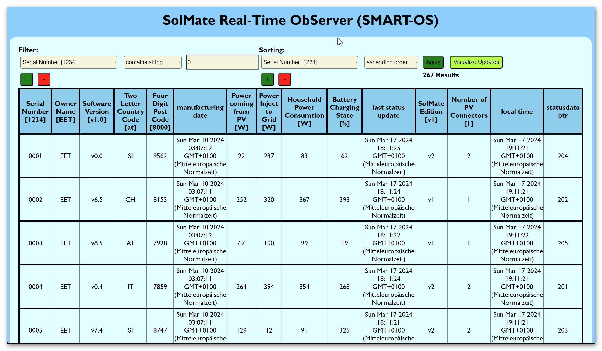

# The SMART-OS Application is documented with MKDocs

## Start Up the Documentation Server

* `mkdocs serve -a 127.0.0.1:9000` 

Open a terminal and change your directory to the directory of this README.md file.

Now run the following commands in your terminal
```
pip install mkdocs
mkdocs serve -a 127.0.0.1:9000
```
Open your webbrowser and enter "127.0.0.1:9000" in your naviation bar.
Read the documentation thoroughly.

## MKDocs Reference

For full MKDocs documentation visit [mkdocs.org](https://www.mkdocs.org).

# Welcome to SMART-OS Doc
The SolMate Real-Time ObServer Documentation
[](https://youtu.be/cNrweBXyBPA)
interactive interface with filter and sorting options. The data gets updated in Real-Time.

# Distinctiveness and Complexity
This project uses Asynchronous programming throughout at the back- and frontend. Concurrent programming is used to simulate multiple remote devices at the same machine.

In contrast to all projects throughout this course, this application does not require continuing client http requests to the server to keep all data updated in Real-Time. Hence this project adds a new level of complexity, performance and enriches the gained skillset within this course.  

Furthermore this project contains thorough testing capabilities which are in stark contrast to most of the project requirements.

The main focus of this project lies in the Real-Time and performant behaviour in data transmission, as well as data simulation. The data customisation is achieved via filter and sorting options.

This project has a real world application, when running the according lightweight python file on any remote device connected with the server. This is because this lightweight python file can easily be customized to represent data of personal interest, related to the machine which it runs on.

## No Social Network
To distuingish from a social network, this project has no ability to post or chat, alltough Django Channels is able to run a chat application very efficiently with Real-Time communication.

## No E-Commerce Site
To distinguish from a Commerce site this project does not contain any selling or buying functionality. 

## Utilizes Django
This App utilizes the Django Framework and makes use of Django Channels, the asynchronous websocket implementation in Django. 

## App is Mobile Responsive
This app has been successfully tested in a local network utilizing Raspberry Pi 4B as remote device (running the lightweight python file), while running the Django Channels Webserver on a computer within this network and accessing it with multiple client devices (Cellphone and laptop) at the same time. The application has been successfully tested with up to 267 simulated remote device instances, updating in Real-Time to the Server, distributed in Real-Time to all clients accessing the server via a browser.

# About SMART-OS
Updated as of 17.03.2024 

## Features
SMART-OS is an App to monitor Data from remote devices and display it in Real-Time publicly to a webserver. This may have an application in tracking device conditions after shipping like battery capacity, software version, power consumption, power generation of photovoltaik panels and keeping the exact geolocation for weather considerations.

### Webserver
The core is made up by a Django Channels server (utilizing asynchronous Daphne server, and a cache maintainance with Redis), enabling the Real-Time data distribution to all clients to this webserver, achieved via a simple GET request to the webservers root route. There is no restriction in accessing the data updates of all updating remote devices.

### Remote Devices
Updates are coming from all devices with active connection to the webserver network, running a single python file ("solmate.py"), stored on the trackable device. After startup it builds up and maintaines a websocket connection to the webserver, sending data only on change (observer pattern) to avoid data overload. By default data history is not stored, all data reflect only the latest updates without access to trends. The latest data received by the server is parallel stored to the database and distributed to all webserver clients. So the database, as well as all connected clients, are updated in Real-Time with the current device parameters. On connection loss the device attempts to reconnect in a defined time interval (default is five seconds). New devices can be automatically registered at the database upon first connection to the webserver. This has to be activated in the according file. 

### Logging
There is a thorough process logging upon startup for the webserver at "solserver/database/log/general.log", storing the latest 1 MB of logging entries. Besides testing procedures all messages towards the server are stored to this file. A data history can therefore be retrieved until this log file is overridden.

## Startup
Detailed information how to start up and test the webserver can be found at the section Start Up.

## TODOs
As any software also this has some potential for improvement and customisation:

* Authentication (device data restriction to owner).

* Pagination (limit results to 10-20 devices each page).

* Break Table (On smaller screen the table should be scrollable while handy to keep an overview).

* Dynamic table entries (Django models should adapt to the monitoring parameters defined by the remote devices - maybe via json file in database).

* Store data history and depict data trends for Machine Learning.

* Show 30 sec trend in GUI upon device click 

* change operating system to Linux for dockerisation and automated documentation. 

* Implement a CI/CD pipeline upon git commit (Each software change ought to be controlled via github actions testing and automated software update distribution to all devices).

* implement remote control for maintainance and software updates (setting parameter and/or runninng downloaded scripts).

* implement capability for IoT (each device should obtain all the data of all the other devices via implementing another channel to achieve this)


# Get started on WINDOWS OS
Before starting up be sure to meet all the system requirements as listed in the specifications section.

run the following command
to start the docker redis container:
```
docker run --rm -p 6379:6379 redis:7
```
#### Unit Testing and Integration Testing
in root/solserver/ directory,
Test the Django server via
```
python .\manage.py test --verbosity 3
```
#### Online Documentation
in root/solserver/ directory,
start the mkdocs server (default: 127.0.0.1:8000) via
```
mkdocs build
mkdocs serve
```
alternatively set an arbitrary Host IP:
```
mkdocs serve -a 192.168.0.192:9000
```
or
```
 mkdocs serve -a 127.0.0.1:9000
```

#### Startup the Django server
in root/solserver/ directory,
start the Django server on port 8080 via:
```
python .\manage.py runserver 127.0.0.1:8080
```
If you want to deploy the app on another Host,
adapt the Django settings.py file (ALLOWED_HOSTS) accordingly.
Also adapt the Host address (SERVER_URL) in the head section of
"root/solserver/solmate_emulation/solmate.py".
Avoid conflicting Port numbers for the mkdocs and the Django server.

#### Real-Time Data Funcitonal Testing 
For Real-Time Data Mimicing start an arbitrary number of SolMate instances.
Go to the root/solserver/solmate_emulation/ directory,
run the solmate.py file via:
```
python .\solmate.py
```
It leads you through a CLI to configure the number and the style of Real-Time Data Mimicing.
```
>>> Please Enter: How many SolMate instances? (<class 'int'>) <<< 
```
It expects you to enter an integer number for the number of emulated SolMate instances.
The System is tested with up to 267 devices at the same time. 

The following questions concern only the distribution of the values and frequency of the updates.
```
>>> Please Enter: Strict monoton behaviour? (y/n) <<< 
```
Enter 'n' to emulate random numbers.
Enter 'y' for emulating data following a function curve.
In the latter case you can choose between linear and sinuid behaviour:
```
>>> Please Enter: sinus curve behaviour? (y/n) <<< 
```
Enter 'n' for linear data behaviour.
Enter 'y' for the data to follow a sinus curve.

Then enter the maximum value for all the emulated data. 
The range goes from 0 - max value and the initial value is chosen randomly.
```
>>> Please Enter: maximum values? (<class 'int'>) <<< 
```
The following questions concern the frequency of data updates.
Enter an integer number to set  the minimum time for the randomly chosen
time between two data updates at the same device.
```
>>> Please Enter: minimum sleep time between two values? (<class 'int'>) <<< 
```
Finally, set the maximum value. 
The value is randomly chosen in this range for each iteration of data update.
```
>>> Please Enter: maximum sleep time between two values? (<class 'int'>) <<< 
```
By default, new devices, not yet registered in the database are not registered.
You can modify this behaviour in the solmate.py file.

## This Documentation is based on MkDocs

For full documentation visit [mkdocs.org](https://www.mkdocs.org).

### Commands

* `mkdocs new [dir-name]` - Create a new project.
* `mkdocs serve` - Start the live-reloading docs server.
* `mkdocs build` - Build the documentation site.
* `mkdocs -h` - Print help message and exit.

### Project layout

    mkdocs.yml    # The configuration file.
    docs/
        index.md  # The documentation homepage.
        ...       # Other markdown pages, images and other files.


# SMART-OS technical details


# Websocket Interfaces 
All updates are running over websocket connections. Each Remote Device builds up a websocket connection via python websockets module to the webserver

## Communication Protocol
Upon connection via websocket to the webserver root route the server may respond with a string like
```
{"type": "INFO", "message": "Welcome to SMART-Server - SolMate Real-Time ObServer! - SolServerConsumer: groups ['updates']"}
```
Note that the message is JSON formatted and consists of a key "type" and a key "message". The type may be one out of four different message types. 
```
types = ["INFO","FILT","INIT","UPDT"]
```
This type is used to identify how to process the message content.

The actual message is always a string, in the case of the welcome message it contains no info for further processing.
### Capping Identificator
For remote device identification and data integrity each message from the remote devices is a string and contains a capping identificator consisting of four digits Message-ID and the four digits device serial number, separated via a colon.
```
"0001:1234:{'parameter_name':'AT','_parameter_name':430}"
```
### Message Body
The body contains the parameters name and their respective value as a python dict (JSON format). Since the message is stringified in the first place, each message ought to be converted to valid python dict first. 

```
 ... {'parameter_name': 'AT', '_parameter_name': 430}
```
Note, that due to the observer pattern applied in the remote device script, some attributes may be named with a leading underscore throughout initialisation process, which comes into play when a remote device connects with the server for the first time. 

### Initialisation Messages
Upon first startup of Remote Devices, they may transmit a python dictionary with all their respective parameters in it, to give the webserver the possibility to write besides the dynamic parameters also all static parameters to the database models.

+ Typical Initial Message

```
{'type': 'INIT', 'message': '0000:0001:{"serial_number": "0001", "solmate_version": "v1", "_software_version": "v8.6", "_country": "DE", "_postcode": 7445, "_power_income": 377, "_power_inject": 336, "_power_consumption": 400, "_battery": 250, "_capacity": 5184000, "_local_time": null, "server_url": "ws://localhost:8000/update/", "websocket": "", "connected": true, "publish": true, "message_id": "0000", "message_queue": {}, "tasks": "", "meassuring": true, "charging": false, "injecting": false, "pv_connectors": 1}'}
```
Note that some of the parameter names have a leading underscore, allthough they may not during updating. This is because of the applied observer pattern within the remote device python script. It utilizes the inherent python class \_\_dict\_\_ attribute to obtain all parameters and their values for initialisation.

+ An Initial message may also look like

In default mode new devices are not sending an initialisation message as stated above. So the initial message of a remote device coming online may look like a simple update message.
```
{'type': 'UPDT', 'message': '0000:0001:{"battery": 350, "software_version": "v2.0", "country": "AT", "postcode": 9733, "power_income": 388, "power_inject": 357, "power_consumption": 289}'}
```
Note that there are no attributes with leading underline.

The receiving webserver has to distinguish between initialisation and update information, hence has to deal with parameters with and without a leading underscore.
## Messages from Remote Devices to the Webserver (Updating)
While running, upon attribute change any connected device will publish the new parameters in JSON format to the webserver via its websocket connection.

+ Valid Data Update from Remote Device
```
{'type': 'UPDT', 'message': '0116:0001:{"power_consumption": 357}'}
```
Note that the body may contain more than one parameters too. This depends on the bottom boundary for update interval and the frequency of attribute change. This can be set in the remote device python script.

+ Typical Server Response to the Remote Device
```
{"type": "INFO", "message": "0116:0001:OK"}
```
Note that the header is the same (message ID and device serial number), while the body contains "OK" if the update has been successfully received by the webserver. Otherwise the body would contain "ERROR".

## Messages from the Webserver to the Web-Client (Monitoring)

The Webserver either distributes data updates from remote devices via websocket connection to the frontend, responds to a filtering/sorting query via open websocket connection, or answers to an initial HTTP GET request.

+ Typical Response

```
{type: 'UPDT', message: '0008:0001:{"local_time": "2024-03-17 14:59:13.047108"}'}
```
The identificator type "UPDT" gives the necessary information to process the message body accordingly without initializing a new table at the frontend, and updates the according existing field, in this example the field "local_time" of device Serial number "0001".

## Messages from Web Clients to the Webserver (Filtering)
Any client successfully connecting its browser to the webserver address via GET request (to the main route) gets redirected to the index.html site. 
Upon loading a websocket connection to the server is created before the client obtains the full dataset out of the database via this websocket connection.

+ Valid JavaScript websocket connection definition

```
// Open websocket connection.
const ws = new WebSocket(
    "ws://"
    + window.location.host
    + '/client/'
);
```

+ Typical Server Response upon successfull websocket connection

```
{type: 'INFO', message: "Welcome to SMART-Server - SolMate Real-Time ObServer! - ClientConsumer: groups ['broadcast']"}
```
Additionally the client can apply filter and sorting options. These are asynchronously sent via websocket connection to the webserver and the filtered/sorted dataset is responded.

+ Valid Query

```
{"type":"FILT","message":["filter:serial_number:=:0","sort:serial_number:<:abc"]}
```
Note the identificator is "FILT", while the message contains a list of filter and sorting arguments. "filter:serial_number:=:0" stands for: Filter the database for all objects with "serial_number" attribute containing a string ("=") like "0". The response will than contain all devices with a four digit serial number containing a "0" character (i.e. "0001", "2032", "1009", "0023", etc.). The sorting argument "sort:serial_number:<:abc" stands for: Sorting for the "serial_number" in descending order ("<") with respect to the alphabet ("abc"). In fact it does not play a role if "abc" or "123" is applied, since the database will automatically consider either characters or numbers, respectively.

+ Typical Server Response
A typical response may be very large, depending on the number of devices within the database.
```
"{\"type\": \"INIT\", \"message\": [{\"serial_number\": \"0004\", \"owner\": \"EET\", \"software_version\": \"v0.3\", \"country\": \"IT\", \"postcode\": \"7125\", \"manufacturing_date\": \"2024-03-10T02:07:11.964058Z\", \"power_income\": 365.0, \"power_inject\": 222.0, \"power_consumption\": 197.0, \"battery\": 100.0, \"last_status_update\": \"2024-03-17T11:17:27.990741Z\", \"solmate_version\": \"v2\", \"pv_connectors\": 2, \"local_time\": \"2024-03-17T11:13:11.804367Z\", \"statusdata_ptr\": 201}, {\"serial_number\": \"0002\", \"owner\": \"EET\", \"software_version\": \"v8.1\", \"country\": \"CH\", \"postcode\": \"8072\", \"manufacturing_date\": \"2024-03-10T02:07:11.981239Z\", \"power_income\": 297.0, \"power_inject\": 35.0, \"power_consumption\": 144.0, \"battery\": 136.0, \"last_status_update\": \"2024-03-17T11:17:26.784476Z\", \"solmate_version\": \"v2\", \"pv_connectors\": 2, \"local_time\": \"2024-03-17T11:13:11.858823Z\", \"statusdata_ptr\": 202}, {\"serial_number\": \"0005\", \"owner\": \"EET\", \"software_version\": \"v7.4\", \"country\": \"IT\", \"postcode\": \"8180\", \"manufacturing_date\": \"2024-03-10T02:07:11.999100Z\", \"power_income\": 102.0, \"power_inject\": 69.0, \"power_consumption\": 421.0, \"battery\": 204.0, \"last_status_update\": \"2024-03-17T11:17:27.983590Z\", \"solmate_version\": \"v2\", \"pv_connectors\": 2, \"local_time\": \"2024-03-17T11:13:11.491536Z\", \"statusdata_ptr\": 203}, {\"serial_number\": \"0001\", \"owner\": \"EET\", \"software_version\": \"v8.6\", \"country\": \"DE\", \"postcode\": \"7445\", \"manufacturing_date\": \"2024-03-10T02:07:12.013945Z\", \"power_income\": 391.0, \"power_inject\": 344.0, \"power_consumption\": 409.0, \"battery\": 256.0, \"last_status_update\": \"2024-03-17T13:14:37.336356Z\", \"solmate_version\": \"v1\", \"pv_connectors\": 1, \"local_time\": null, \"statusdata_ptr\": 204}, {\"serial_number\": \"0003\", \"owner\": \"EET\", \"software_version\": \"v4.6\", \"country\": \"SI\", \"postcode\": \"8531\", \"manufacturing_date\": \"2024-03-10T02:07:12.027624Z\", \"power_income\": 134.0, \"power_inject\": 109.0, \"power_consumption\": 398.0, \"battery\": 388.0, \"last_status_update\": \"2024-03-17T11:17:24.934368Z\", \"solmate_version\": \"v2\", \"pv_connectors\": 2, \"local_time\": \"2024-03-17T11:13:12.860872Z\", \"statusdata_ptr\": 205}, {\"serial_number\": \"0006\", \"owner\": \"EET\", \"software_version\": \"v8.8\", \"country\": \"CH\", \"postcode\": \"8039\", \"manufacturing_date\": \"2024-03-10T02:07:13.009590Z\", \"power_income\": 134.0, \"power_inject\": 229.0, \"power_consumption\": 164.0, \"battery\": 217.0, \"last_status_update\": \"2024-03-17T11:17:22.019773Z\", \"solmate_version\": \"v1\", \"pv_connectors\": 1, \"local_time\": \"2024-03-11T03:23:30.214392Z\", \"statusdata_ptr\": 206}, {\"serial_number\": \"0007\", \"owner\": \"EET\", \"software_version\": \"v3.0\", \"country\": \"IT\", \"postcode\": \"7844\", \"manufacturing_date\": \"2024-03-10T02:07:13.862026Z\", \"power_income\": 378.0, \"power_inject\": 190.0, \"power_consumption\": 63.0, \"battery\": 83.0, \"last_status_update\": \"2024-03-17T11:17:24.919272Z\", \"solmate_version\": \"v2\", \"pv_connectors\": 2, \"local_time\": \"2024-03-17T11:13:14.200735Z\", \"statusdata_ptr\": 207}, {\"serial_number\": \"0008\", \"owner\": \"EET\", \"software_version\": \"v6.5\", \"country\": \"AT\", \"postcode\": \"7873\", \"manufacturing_date\": \"2024-03-10T02:07:14.895947Z\", \"power_income\": 303.0, \"power_inject\": 278.0, \"power_consumption\": 86.0, \"battery\": 113.0, \"last_status_update\": \"2024-03-17T11:17:26.913414Z\", \"solmate_version\": \"v1\", \"pv_connectors\": 1, \"local_time\": \"2024-03-17T12:17:17.714435Z\", \"statusdata_ptr\": 208}, {\"serial_number\": \"0009\", \"owner\": \"EET\", \"software_version\": \"v2.7\", \"country\": \"AT\", \"postcode\": \"8217\", \"manufacturing_date\": \"2024-03-10T02:07:15.912868Z\", \"power_income\": 373.0, \"power_inject\": 333.0, \"power_consumption\": 293.0, \"battery\": 79.0, \"last_status_update\": \"2024-03-17T11:17:27.731785Z\", \"solmate_version\": \"v2\", \"pv_connectors\": 2, \"local_time\": \"2024-03-17T12:17:17.714435Z\", \"statusdata_ptr\": 209}, {\"serial_number\": \"0010\", \"owner\": \"EET\", \"software_version\": \"v5.3\", \"country\": \"DE\", \"postcode\": \"9957\", \"manufacturing_date\": \"2024-03-10T02:07:17.005511Z\", \"power_income\": 192.0, \"power_inject\": 333.0, \"power_consumption\": 217.0, \"battery\": 361.0, \"last_status_update\": \"2024-03-17T11:17:24.997217Z\", \"solmate_version\": \"v2\", \"pv_connectors\": 2, \"local_time\": \"2024-03-17T12:17:17.714435Z\", \"statusdata_ptr\": 210}, {\"serial_number\": \"0011\", \"owner\": \"EET\", \"software_version\": \"v0.3\", \"country\": \"IT\", \"postcode\": \"7595\", \"manufacturing_date\": \"2024-03-10T02:07:17.954615Z\", \"power_income\": 41.0, \"power_inject\": 413.0, \"power_consumption\": 52.0, \"battery\": 118.0, \"last_status_update\": \"2024-03-17T11:17:27.782726Z\", \"solmate_version\": \"v1\", \"pv_connectors\": 1, \"local_time\": \"2024-03-17T11:04:34.216259Z\", \"statusdata_ptr\": 211}, {\"serial_number\": \"0012\", \"owner\": \"EET\", \"software_version\": \"v0.0\", \"country\": \"CH\", \"postcode\": \"8681\", \"manufacturing_date\": \"2024-03-10T02:07:18.995044Z\", \"power_income\": 333.0, \"power_inject\": 412.0, \"power_consumption\": 84.0, \"battery\": 265.0, \"last_status_update\": \"2024-03-17T11:17:27.956998Z\", \"solmate_version\": \"v1\", \"pv_connectors\": 1, \"local_time\": \"2024-03-17T12:17:17.714435Z\", \"statusdata_ptr\": 212}, {\"serial_number\": \"0013\", \"owner\": \"EET\", \"software_version\": \"v0.8\", \"country\": \"SI\", \"postcode\": \"9329\", \"manufacturing_date\": \"2024-03-10T02:07:20.026028Z\", \"power_income\": 401.0, \"power_inject\": 239.0, \"power_consumption\": 326.0, \"battery\": 113.0, \"last_status_update\": \"2024-03-17T11:17:22.908106Z\", \"solmate_version\": \"v2\", \"pv_connectors\": 2, \"local_time\": \"2024-03-17T11:13:11.491024Z\", \"statusdata_ptr\": 213}, {\"serial_number\": \"0014\", \"owner\": \"EET\", \"software_version\": \"v7.5\", \"country\": \"AT\", \"postcode\": \"7475\", \"manufacturing_date\": \"2024-03-10T02:07:20.919991Z\", \"power_income\": 213.0, \"power_inject\": 195.0, \"power_consumption\": 193.0, \"battery\": 422.0, \"last_status_update\": \"2024-03-17T11:17:27.795609Z\", \"solmate_version\": \"v1\", \"pv_connectors\": 1, \"local_time\": \"2024-03-17T12:17:17.714435Z\", \"statusdata_ptr\": 214}, {\"serial_number\": \"0019\", \"owner\": \"EET\", \"software_version\": \"v2.8\", \"country\": \"AT\", \"postcode\": \"8105\", \"manufacturing_date\": \"2024-03-10T02:07:22.064457Z\", \"power_income\": 395.0, \"power_inject\": 346.0, \"power_consumption\": 408.0, \"battery\": 320.0, \"last_status_update\": \"2024-03-17T11:17:27.970921Z\", \"solmate_version\": \"v1\", \"pv_connectors\": 1, \"local_time\": \"2024-03-17T12:17:17.714435Z\", \"statusdata_ptr\": 215}, {\"serial_number\": \"0020\", \"owner\": \"EET\", \"software_version\": \"v4.5\", \"country\": \"CH\", \"postcode\": \"8090\", \"manufacturing_date\": \"2024-03-10T02:07:22.083749Z\", \"power_income\": 326.0, \"power_inject\": 400.0, \"power_consumption\": 413.0, \"battery\": 137.0, \"last_status_update\": \"2024-03-17T11:17:26.133019Z\", \"solmate_version\": \"v2\", \"pv_connectors\": 2, \"local_time\": \"2024-03-17T12:17:17.714435Z\", \"statusdata_ptr\": 216}, {\"serial_number\": \"0015\", \"owner\": \"EET\", \"software_version\": \"v0.8\", \"country\": \"SI\", \"postcode\": \"7237\", \"manufacturing_date\": \"2024-03-10T02:07:22.124962Z\", \"power_income\": 275.0, \"power_inject\": 96.0, \"power_consumption\": 378.0, \"battery\": 99.0, \"last_status_update\": \"2024-03-17T11:17:23.948632Z\", \"solmate_version\": \"v1\", \"pv_connectors\": 1, \"local_time\": \"2024-03-12T17:47:03.094542Z\", \"statusdata_ptr\": 217}, {\"serial_number\": \"0016\", \"owner\": \"EET\", \"software_version\": \"v7.1\", \"country\": \"IT\", \"postcode\": \"8682\", \"manufacturing_date\": \"2024-03-10T02:07:23.005443Z\", \"power_income\": 99.0, \"power_inject\": 195.0, \"power_consumption\": 48.0, \"battery\": 364.0, \"last_status_update\": \"2024-03-17T11:17:26.772615Z\", \"solmate_version\": \"v1\", \"pv_connectors\": 1, \"local_time\": \"2024-03-17T10:49:59.861802Z\", \"statusdata_ptr\": 218}, {\"serial_number\": \"0017\", \"owner\": \"EET\", \"software_version\": \"v8.5\", \"country\": \"IT\", \"postcode\": \"9459\", \"manufacturing_date\": \"2024-03-10T02:07:24.021584Z\", \"power_income\": 411.0, \"power_inject\": 194.0, \"power_consumption\": 272.0, \"battery\": 54.0, \"last_status_update\": \"2024-03-17T11:17:27.769980Z\", \"solmate_version\": \"v1\", \"pv_connectors\": 1, \"local_time\": \"2024-03-17T11:13:14.202140Z\", \"statusdata_ptr\": 219}, {\"serial_number\": \"0018\", \"owner\": \"EET\", \"software_version\": \"v6.1\", \"country\": \"DE\", \"postcode\": \"8443\", \"manufacturing_date\": \"2024-03-10T02:07:24.990229Z\", \"power_income\": 159.0, \"power_inject\": 201.0, \"power_consumption\": 424.0, \"battery\": 268.0, \"last_status_update\": \"2024-03-17T11:17:24.017596Z\", \"solmate_version\": \"v1\", \"pv_connectors\": 1, \"local_time\": \"2024-03-17T12:17:17.714435Z\", \"statusdata_ptr\": 220}, {\"serial_number\": \"0150\", \"owner\": \"EET\", \"software_version\": \"v8.0\", \"country\": \"AT\", \"postcode\": \"8719\", \"manufacturing_date\": \"2024-03-10T22:00:43.930169Z\", \"power_income\": 49.0, \"power_inject\": 38.0, \"power_consumption\": 197.0, \"battery\": 111.0, \"last_status_update\": \"2024-03-11T02:20:42.366869Z\", \"solmate_version\": \"v1\", \"pv_connectors\": 1, \"local_time\": \"2024-03-11T03:20:39.270374Z\", \"statusdata_ptr\": 221}, {\"serial_number\": \"0206\", \"owner\": \"EET\", \"software_version\": \"v0.8\", \"country\": \"CH\", \"postcode\": \"9743\", \"manufacturing_date\": \"2024-03-10T22:00:43.962952Z\", \"power_income\": 376.0, \"power_inject\": 392.0, \"power_consumption\": 363.0, \"battery\": 333.0, \"last_status_update\": \"2024-03-11T00:58:12.341545Z\", \"solmate_version\": \"v2\", \"pv_connectors\": 2, \"local_time\": \"2024-03-11T01:57:58.573351Z\", \"statusdata_ptr\": 222}, {\"serial_number\": \"0027\", \"owner\": \"EET\", \"software_version\": \"v8.2\", \"country\": \"CH\", \"postcode\": \"8264\", \"manufacturing_date\": \"2024-03-10T22:00:43.981589Z\", \"power_income\": 1446.0, \"power_inject\": 8505.0, \"power_consumption\": 3612.0, \"battery\": 2575.0, \"last_status_update\": \"2024-03-17T09:50:17.237945Z\", \"solmate_version\": \"v2\", \"pv_connectors\": 2, \"local_time\": \"2024-03-12T17:47:08.073559Z\", \"statusdata_ptr\": 223}, {\"serial_number\": \"0068\", \"owner\": \"EET\", \"software_version\": \"v3.1\", \"country\": \"DE\", \"postcode\": \"7356\", \"manufacturing_date\": \"2024-03-10T22:00:44.055129Z\", \"power_income\": 1299.0, \"power_inject\": 3390.0, \"power_consumption\": 6599.0, \"battery\": 3924.0, \"last_status_update\": \"2024-03-17T09:50:17.194351Z\", \"solmate_version\": \"v2\", \"pv_connectors\": 2, \"local_time\": \"2024-03-12T17:47:01.099770Z\", \"statusdata_ptr\": 224}, {\"serial_number\": \"0078\", \"owner\": \"EET\", \"software_version\": \"v3.5\", \"country\": \"CH\", \"postcode\": \"9183\", \"manufacturing_date\": \"2024-03-10T22:00:44.068636Z\", \"power_income\": 6926.0, \"power_inject\": 9092.0, \"power_consumption\": 9914.0, \"battery\": 4405.0, \"last_status_update\": \"2024-03-17T09:50:21.578466Z\", \"solmate_version\": \"v1\", \"pv_connectors\": 1, \"local_time\": \"2024-03-11T03:20:40.513331Z\", \"statusdata_ptr\": 225}, {\"serial_number\": \"0154\", \"owner\": \"EET\", \"software_version\": \"v3.1\", \"country\": \"SI\", \"postcode\": \"7143\", \"manufacturing_date\": \"2024-03-10T22:00:44.081758Z\", \"power_income\": 207.0, \"power_inject\": 17.0, \"power_consumption\": 267.0, \"battery\": 91.0, \"last_status_update\": \"2024-03-11T02:20:38.634533Z\", \"solmate_version\": \"v1\", \"pv_connectors\": 1, \"local_time\": \"2024-03-11T03:20:37.858168Z\", \"statusdata_ptr\": 226}, {\"serial_number\": \"0198\", \"owner\": \"EET\", \"software_version\": \"v3.0\", \"country\": \"AT\", \"postcode\": \"7783\", \"manufacturing_date\": \"2024-03-10T22:00:44.100355Z\", \"power_income\": 325.0, \"power_inject\": 50.0, \"power_consumption\": 422.0, \"battery\": 168.0, \"last_status_update\": \"2024-03-11T02:20:45.268354Z\", \"solmate_version\": \"v1\", \"pv_connectors\": 1, \"local_time\": \"2024-03-11T01:58:00.841046Z\", \"statusdata_ptr\": 227}, {\"serial_number\": \"0127\", \"owner\": \"EET\", \"software_version\": \"v6.5\", \"country\": \"IT\", \"postcode\": \"9932\", \"manufacturing_date\": \"2024-03-10T22:00:44.165862Z\", \"power_income\": 358.0, \"power_inject\": 427.0, \"power_consumption\": 397.0, \"battery\": 392.0, \"last_status_update\": \"2024-03-11T02:20:43.706953Z\", \"solmate_version\": \"v2\", \"pv_connectors\": 2, \"local_time\": \"2024-03-11T03:20:37.858168Z\", \"statusdata_ptr\": 228}, {\"serial_number\": \"0085\", \"owner\": \"EET\", \"software_version\": \"v8.4\", \"country\": \"AT\", \"postcode\": \"8346\", \"manufacturing_date\": \"2024-03-10T22:00:44.185870Z\", \"power_income\": 9975.0, \"power_inject\": 5899.0, \"power_consumption\": 9855.0, \"battery\": 4694.0, \"last_status_update\": \"2024-03-17T09:50:20.332917Z\", \"solmate_version\": \"v1\", \"pv_connectors\": 1, \"local_time\": \"2024-03-11T03:23:30.017129Z\", \"statusdata_ptr\": 229}, {\"serial_number\": \"0203\", \"owner\": \"EET\", \"software_version\": \"v5.1\", \"country\": \"IT\", \"postcode\": \"9559\", \"manufacturing_date\": \"2024-03-10T22:00:44.208988Z\", \"power_income\": 419.0, \"power_inject\": 297.0, \"power_consumption\": 221.0, \"battery\": 87.0, \"last_status_update\": \"2024-03-11T00:58:04.922626Z\", \"solmate_version\": \"v2\", \"pv_connectors\": 2, \"local_time\": \"2024-03-11T01:46:48.528200Z\", \"statusdata_ptr\": 230}, {\"serial_number\": \"0204\", \"owner\": \"EET\", \"software_version\": \"v2.2\", \"country\": \"DE\", \"postcode\": \"7915\", \"manufacturing_date\": \"2024-03-10T22:00:44.256905Z\", \"power_income\": 253.0, \"power_inject\": 6.0, \"power_consumption\": 127.0, \"battery\": 197.0, \"last_status_update\": \"2024-03-11T00:58:08.001063Z\", \"solmate_version\": \"v1\", \"pv_connectors\": 1, \"local_time\": null, \"statusdata_ptr\": 231}, {\"serial_number\": \"0128\", \"owner\": \"EET\", \"software_version\": \"v0.2\", \"country\": \"AT\", \"postcode\": \"7117\", \"manufacturing_date\": \"2024-03-10T22:00:44.307753Z\", \"power_income\": 135.0, \"power_inject\": 215.0, \"power_consumption\": 397.0, \"battery\": 195.0, \"last_status_update\": \"2024-03-11T02:20:28.569842Z\", \"solmate_version\": \"v2\", \"pv_connectors\": 2, \"local_time\": \"2024-03-11T01:46:47.016893Z\", \"statusdata_ptr\": 232}, {\"serial_number\": \"0212\", \"owner\": \"EET\", \"software_version\": \"v3.3\", \"country\": \"CH\", \"postcode\": \"9618\", \"manufacturing_date\": \"2024-03-10T22:00:44.354992Z\", \"power_income\": 220.0, \"power_inject\": 19.0, \"power_consumption\": 38.0, \"battery\": 5.0, \"last_status_update\": \"2024-03-11T00:58:06.183972Z\", \"solmate_version\": \"v2\", \"pv_connectors\": 2, \"local_time\": \"2024-03-11T01:57:58.887035Z\", \"statusdata_ptr\": 233}, {\"serial_number\": \"0214\", \"owner\": \"EET\", \"software_version\": \"v7.7\", \"country\": \"CH\", \"postcode\": \"7593\", \"manufacturing_date\": \"2024-03-10T22:00:44.397467Z\", \"power_income\": 235.0, \"power_inject\": 274.0, \"power_consumption\": 89.0, \"battery\": 337.0, \"last_status_update\": \"2024-03-11T00:58:01.967561Z\", \"solmate_version\": \"v2\", \"pv_connectors\": 2, \"local_time\": \"2024-03-11T01:57:58.235657Z\", \"statusdata_ptr\": 234}, {\"serial_number\": \"0108\", \"owner\": \"EET\", \"software_version\": \"v5.1\", \"country\": \"SI\", \"postcode\": \"9827\", \"manufacturing_date\": \"2024-03-10T22:00:44.427846Z\", \"power_income\": 361.0, \"power_inject\": 215.0, \"power_consumption\": 236.0, \"battery\": 182.0, \"last_status_update\": \"2024-03-11T02:20:41.641487Z\", \"solmate_version\": \"v2\", \"pv_connectors\": 2, \"local_time\": \"2024-03-11T03:20:37.632941Z\", \"statusdata_ptr\": 235}, {\"serial_number\": \"0044\", \"owner\": \"EET\", \"software_version\": \"v8.7\", \"country\": \"IT\", \"postcode\": \"9131\", \"manufacturing_date\": \"2024-03-10T22:00:44.466363Z\", \"power_income\": 4144.0, \"power_inject\": 5524.0, \"power_consumption\": 4711.0, \"battery\": 9502.0, \"last_status_update\": \"2024-03-17T09:50:18.022686Z\", \"solmate_version\": \"v2\", \"pv_connectors\": 2, \"local_time\": \"2024-03-11T03:20:09.107136Z\", \"statusdata_ptr\": 236}, {\"serial_number\": \"0209\", \"owner\": \"EET\", \"software_version\": \"v8.1\", \"country\": \"AT\", \"postcode\": \"7897\", \"manufacturing_date\": \"2024-03-10T22:00:44.501635Z\", \"power_income\": 401.0, \"power_inject\": 198.0, \"power_consumption\": 55.0, \"battery\": 49.0, \"last_status_update\": \"2024-03-11T00:58:02.383333Z\", \"solmate_version\": \"v2\", \"pv_connectors\": 2, \"local_time\": \"2024-03-11T01:57:58.470182Z\", \"statusdata_ptr\": 237}, {\"serial_number\": \"0121\", \"owner\": \"EET\", \"software_version\": \"v0.4\", \"country\": \"SI\", \"postcode\": \"9392\", \"manufacturing_date\": \"2024-03-10T22:00:44.553187Z\", \"power_income\": 322.0, \"power_inject\": 275.0, \"power_consumption\": 91.0, \"battery\": 257.0, \"last_status_update\": \"2024-03-11T02:20:43.386637Z\", \"solmate_version\": \"v1\", \"pv_connectors\": 1, \"local_time\": \"2024-03-11T03:20:39.517030Z\", \"statusdata_ptr\": 238}, {\"serial_number\": \"0171\", \"owner\": \"EET\", \"software_version\": \"v3.5\", \"country\": \"AT\", \"postcode\": \"9011\", \"manufacturing_date\": \"2024-03-10T22:00:44.599624Z\", \"power_income\": 421.0, \"power_inject\": 352.0, \"power_consumption\": 187.0, \"battery\": 344.0, \"last_status_update\": \"2024-03-11T02:20:44.399747Z\", \"solmate_version\": \"v1\", \"pv_connectors\": 1, \"local_time\": null, \"statusdata_ptr\": 239}, {\"serial_number\": \"0091\", \"owner\": \"EET\", \"software_version\": \"v0.4\", \"country\": \"CH\", \"postcode\": \"7041\", \"manufacturing_date\": \"2024-03-10T22:00:44.638615Z\", \"power_income\": 9727.0, \"power_inject\": 2077.0, \"power_consumption\": 6303.0, \"battery\": 5727.0, \"last_status_update\": \"2024-03-17T09:50:24.121914Z\", \"solmate_version\": \"v1\", \"pv_connectors\": 1, \"local_time\": \"2024-03-17T10:49:45.036195Z\", \"statusdata_ptr\": 240}, {\"serial_number\": \"0151\", \"owner\": \"EET\", \"software_version\": \"v1.6\", \"country\": \"SI\", \"postcode\": \"8120\", \"manufacturing_date\": \"2024-03-10T22:00:44.677734Z\", \"power_income\": 257.0, \"power_inject\": 51.0, \"power_consumption\": 73.0, \"battery\": 320.0, \"last_status_update\": \"2024-03-11T02:20:37.152146Z\", \"solmate_version\": \"v1\", \"pv_connectors\": 1, \"local_time\": null, \"statusdata_ptr\": 241}, {\"serial_number\": \"0056\", \"owner\": \"EET\", \"software_version\": \"v3.7\", \"country\": \"SI\", \"postcode\": \"8427\", \"manufacturing_date\": \"2024-03-10T22:00:44.693384Z\", \"power_income\": 7986.0, \"power_inject\": 1670.0, \"power_consumption\": 4244.0, \"battery\": 8947.0, \"last_status_update\": \"2024-03-17T09:50:24.682214Z\", \"solmate_version\": \"v1\", \"pv_connectors\": 1, \"local_time\": \"2024-03-11T03:23:29.770168Z\", \"statusdata_ptr\": 242}, {\"serial_number\": \"0161\", \"owner\": \"EET\", \"software_version\": \"v3.2\", \"country\": \"AT\", \"postcode\": \"7544\", \"manufacturing_date\": \"2024-03-10T22:00:44.702830Z\", \"power_income\": 121.0, \"power_inject\": 332.0, \"power_consumption\": 157.0, \"battery\": 296.0, \"last_status_update\": \"2024-03-11T02:20:26.467977Z\", \"solmate_version\": \"v1\", \"pv_connectors\": 1, \"local_time\": \"2024-03-11T03:20:09.105824Z\", \"statusdata_ptr\": 243}, {\"serial_number\": \"0202\", \"owner\": \"EET\", \"software_version\": \"v6.1\", \"country\": \"DE\", \"postcode\": \"7823\", \"manufacturing_date\": \"2024-03-10T22:00:44.714565Z\", \"power_income\": 151.0, \"power_inject\": 360.0, \"power_consumption\": 351.0, \"battery\": 341.0, \"last_status_update\": \"2024-03-11T00:58:10.742687Z\", \"solmate_version\": \"v2\", \"pv_connectors\": 2, \"local_time\": \"2024-03-11T01:46:48.778821Z\", \"statusdata_ptr\": 244}, {\"serial_number\": \"0159\", \"owner\": \"EET\", \"software_version\": \"v8.4\", \"country\": \"CH\", \"postcode\": \"8752\", \"manufacturing_date\": \"2024-03-10T22:00:44.725626Z\", \"power_income\": 189.0, \"power_inject\": 300.0, \"power_consumption\": 322.0, \"battery\": 208.0, \"last_status_update\": \"2024-03-11T02:20:45.318325Z\", \"solmate_version\": \"v2\", \"pv_connectors\": 2, \"local_time\": \"2024-03-11T03:20:38.630037Z\", \"statusdata_ptr\": 245}, {\"serial_number\": \"0060\", \"owner\": \"EET\", \"software_version\": \"v5.4\", \"country\": \"AT\", \"postcode\": \"7224\", \"manufacturing_date\": \"2024-03-10T22:00:44.736470Z\", \"power_income\": 2997.0, \"power_inject\": 5610.0, \"power_consumption\": 6542.0, \"battery\": 8511.0, \"last_status_update\": \"2024-03-17T09:50:22.882127Z\", \"solmate_version\": \"v1\", \"pv_connectors\": 1, \"local_time\": \"2024-03-12T17:47:04.085192Z\", \"statusdata_ptr\": 246}, {\"serial_number\": \"0192\", \"owner\": \"EET\", \"software_version\": \"v4.1\", \"country\": \"SI\", \"postcode\": \"8288\", \"manufacturing_date\": \"2024-03-10T22:00:44.747361Z\", \"power_income\": 387.0, \"power_inject\": 394.0, \"power_consumption\": 206.0, \"battery\": 100.0, \"last_status_update\": \"2024-03-11T02:20:43.930422Z\", \"solmate_version\": \"v2\", \"pv_connectors\": 2, \"local_time\": \"2024-03-11T01:46:47.773002Z\", \"statusdata_ptr\": 247}, {\"serial_number\": \"0152\", \"owner\": \"EET\", \"software_version\": \"v6.2\", \"country\": \"IT\", \"postcode\": \"9261\", \"manufacturing_date\": \"2024-03-10T22:00:44.758277Z\", \"power_income\": 69.0, \"power_inject\": 268.0, \"power_consumption\": 166.0, \"battery\": 179.0, \"last_status_update\": \"2024-03-11T02:20:43.903729Z\", \"solmate_version\": \"v2\", \"pv_connectors\": 2, \"local_time\": \"2024-03-11T03:20:39.981316Z\", \"statusdata_ptr\": 248}, {\"serial_number\": \"0115\", \"owner\": \"EET\", \"software_version\": \"v2.1\", \"country\": \"CH\", \"postcode\": \"8185\", \"manufacturing_date\": \"2024-03-10T22:00:44.764450Z\", \"power_income\": 101.0, \"power_inject\": 31.0, \"power_consumption\": 253.0, \"battery\": 422.0, \"last_status_update\": \"2024-03-11T02:20:43.396045Z\", \"solmate_version\": \"v1\", \"pv_connectors\": 1, \"local_time\": \"2024-03-11T03:20:38.262332Z\", \"statusdata_ptr\": 249}, {\"serial_number\": \"0071\", \"owner\": \"EET\", \"software_version\": \"v7.8\", \"country\": \"AT\", \"postcode\": \"8262\", \"manufacturing_date\": \"2024-03-10T22:00:44.784991Z\", \"power_income\": 6110.0, \"power_inject\": 4844.0, \"power_consumption\": 2119.0, \"battery\": 9850.0, \"last_status_update\": \"2024-03-17T09:50:25.474722Z\", \"solmate_version\": \"v1\", \"pv_connectors\": 1, \"local_time\": \"2024-03-12T17:47:03.050596Z\", \"statusdata_ptr\": 250}, {\"serial_number\": \"0051\", \"owner\": \"EET\", \"software_version\": \"v2.5\", \"country\": \"DE\", \"postcode\": \"7793\", \"manufacturing_date\": \"2024-03-10T22:00:44.796827Z\", \"power_income\": 7876.0, \"power_inject\": 5877.0, \"power_consumption\": 1990.0, \"battery\": 8863.0, \"last_status_update\": \"2024-03-17T09:50:22.582212Z\", \"solmate_version\": \"v2\", \"pv_connectors\": 2, \"local_time\": \"2024-03-11T01:57:58.236657Z\", \"statusdata_ptr\": 251}, {\"serial_number\": \"0174\", \"owner\": \"EET\", \"software_version\": \"v0.7\", \"country\": \"DE\", \"postcode\": \"8886\", \"manufacturing_date\": \"2024-03-10T22:00:44.808027Z\", \"power_income\": 207.0, \"power_inject\": 227.0, \"power_consumption\": 82.0, \"battery\": 402.0, \"last_status_update\": \"2024-03-11T02:20:44.243882Z\", \"solmate_version\": \"v2\", \"pv_connectors\": 2, \"local_time\": \"2024-03-11T03:20:38.630037Z\", \"statusdata_ptr\": 252}, {\"serial_number\": \"0215\", \"owner\": \"EET\", \"software_version\": \"v4.7\", \"country\": \"AT\", \"postcode\": \"7596\", \"manufacturing_date\": \"2024-03-10T22:00:44.829695Z\", \"power_income\": 314.0, \"power_inject\": 28.0, \"power_consumption\": 354.0, \"battery\": 399.0, \"last_status_update\": \"2024-03-11T00:58:04.574612Z\", \"solmate_version\": \"v1\", \"pv_connectors\": 1, \"local_time\": \"2024-03-11T01:57:58.556187Z\", \"statusdata_ptr\": 253}, {\"serial_number\": \"0112\", \"owner\": \"EET\", \"software_version\": \"v2.3\", \"country\": \"CH\", \"postcode\": \"8371\", \"manufacturing_date\": \"2024-03-10T22:00:44.840200Z\", \"power_income\": 158.0, \"power_inject\": 20.0, \"power_consumption\": 58.0, \"battery\": 339.0, \"last_status_update\": \"2024-03-11T02:20:26.627619Z\", \"solmate_version\": \"v1\", \"pv_connectors\": 1, \"local_time\": \"2024-03-11T01:57:58.470708Z\", \"statusdata_ptr\": 254}, {\"serial_number\": \"0130\", \"owner\": \"EET\", \"software_version\": \"v8.3\", \"country\": \"AT\", \"postcode\": \"7335\", \"manufacturing_date\": \"2024-03-10T22:00:44.850267Z\", \"power_income\": 35.0, \"power_inject\": 104.0, \"power_consumption\": 176.0, \"battery\": 155.0, \"last_status_update\": \"2024-03-11T02:20:37.072088Z\", \"solmate_version\": \"v1\", \"pv_connectors\": 1, \"local_time\": null, \"statusdata_ptr\": 255}, {\"serial_number\": \"0246\", \"owner\": \"EET\", \"software_version\": \"\", \"country\": \"\", \"postcode\": \"\", \"manufacturing_date\": \"2024-03-10T22:00:44.858876Z\", \"power_income\": 0.0, \"power_inject\": 0.0, \"power_consumption\": 64.0, \"battery\": 0.0, \"last_status_update\": \"2024-03-11T00:58:02.024420Z\", \"solmate_version\": \"v2\", \"pv_connectors\": 2, \"local_time\": \"2024-03-11T01:57:58.231655Z\", \"statusdata_ptr\": 256}, {\"serial_number\": \"0196\", \"owner\": \"EET\", \"software_version\": \"v8.6\", \"country\": \"CH\", \"postcode\": \"7464\", \"manufacturing_date\": \"2024-03-10T22:00:44.868350Z\", \"power_income\": 89.0, \"power_inject\": 14.0, \"power_consumption\": 377.0, \"battery\": 114.0, \"last_status_update\": \"2024-03-11T02:20:44.930493Z\", \"solmate_version\": \"v2\", \"pv_connectors\": 2, \"local_time\": \"2024-03-11T03:20:38.262332Z\", \"statusdata_ptr\": 257}, {\"serial_number\": \"0166\", \"owner\": \"EET\", \"software_version\": \"v1.0\", \"country\": \"SI\", \"postcode\": \"8169\", \"manufacturing_date\": \"2024-03-10T22:00:44.877360Z\", \"power_income\": 157.0, \"power_inject\": 76.0, \"power_consumption\": 170.0, \"battery\": 358.0, \"last_status_update\": \"2024-03-11T02:20:43.620262Z\", \"solmate_version\": \"v2\", \"pv_connectors\": 2, \"local_time\": \"2024-03-11T03:20:10.421371Z\", \"statusdata_ptr\": 258}, {\"serial_number\": \"0064\", \"owner\": \"EET\", \"software_version\": \"v8.2\", \"country\": \"CH\", \"postcode\": \"9836\", \"manufacturing_date\": \"2024-03-10T22:00:44.886221Z\", \"power_income\": 6326.0, \"power_inject\": 1495.0, \"power_consumption\": 4925.0, \"battery\": 8091.0, \"last_status_update\": \"2024-03-17T09:50:25.172421Z\", \"solmate_version\": \"v1\", \"pv_connectors\": 1, \"local_time\": \"2024-03-17T10:50:01.528341Z\", \"statusdata_ptr\": 259}, {\"serial_number\": \"0195\", \"owner\": \"EET\", \"software_version\": \"v7.6\", \"country\": \"AT\", \"postcode\": \"7221\", \"manufacturing_date\": \"2024-03-10T22:00:44.900779Z\", \"power_income\": 415.0, \"power_inject\": 193.0, \"power_consumption\": 317.0, \"battery\": 168.0, \"last_status_update\": \"2024-03-11T02:20:43.258703Z\", \"solmate_version\": \"v1\", \"pv_connectors\": 1, \"local_time\": null, \"statusdata_ptr\": 260}, {\"serial_number\": \"0048\", \"owner\": \"EET\", \"software_version\": \"v6.7\", \"country\": \"AT\", \"postcode\": \"7181\", \"manufacturing_date\": \"2024-03-10T22:00:44.909689Z\", \"power_income\": 1796.0, \"power_inject\": 8365.0, \"power_consumption\": 6732.0, \"battery\": 1297.0, \"last_status_update\": \"2024-03-17T09:50:21.438231Z\", \"solmate_version\": \"v1\", \"pv_connectors\": 1, \"local_time\": \"2024-03-12T17:47:00.958933Z\", \"statusdata_ptr\": 261}, {\"serial_number\": \"0040\", \"owner\": \"EET\", \"software_version\": \"v2.8\", \"country\": \"DE\", \"postcode\": \"7169\", \"manufacturing_date\": \"2024-03-10T22:00:44.919727Z\", \"power_income\": 6343.0, \"power_inject\": 7044.0, \"power_consumption\": 1241.0, \"battery\": 9764.0, \"last_status_update\": \"2024-03-17T09:50:16.523590Z\", \"solmate_version\": \"v2\", \"pv_connectors\": 2, \"local_time\": \"2024-03-12T17:47:02.048889Z\", \"statusdata_ptr\": 262}, {\"serial_number\": \"0094\", \"owner\": \"EET\", \"software_version\": \"v0.5\", \"country\": \"CH\", \"postcode\": \"9305\", \"manufacturing_date\": \"2024-03-10T22:00:44.928614Z\", \"power_income\": 9989.0, \"power_inject\": 3204.0, \"power_consumption\": 5627.0, \"battery\": 5378.0, \"last_status_update\": \"2024-03-17T09:50:17.303183Z\", \"solmate_version\": \"v2\", \"pv_connectors\": 2, \"local_time\": \"2024-03-12T17:47:01.049133Z\", \"statusdata_ptr\": 263}, {\"serial_number\": \"0190\", \"owner\": \"EET\", \"software_version\": \"v5.1\", \"country\": \"DE\", \"postcode\": \"8848\", \"manufacturing_date\": \"2024-03-10T22:00:44.948460Z\", \"power_income\": 409.0, \"power_inject\": 286.0, \"power_consumption\": 178.0, \"battery\": 255.0, \"last_status_update\": \"2024-03-11T02:20:43.596081Z\", \"solmate_version\": \"v1\", \"pv_connectors\": 1, \"local_time\": \"2024-03-11T01:58:01.510284Z\", \"statusdata_ptr\": 264}, {\"serial_number\": \"0052\", \"owner\": \"EET\", \"software_version\": \"v4.7\", \"country\": \"AT\", \"postcode\": \"9219\", \"manufacturing_date\": \"2024-03-10T22:00:44.957902Z\", \"power_income\": 857.0, \"power_inject\": 7507.0, \"power_consumption\": 5898.0, \"battery\": 1584.0, \"last_status_update\": \"2024-03-17T09:50:22.869053Z\", \"solmate_version\": \"v2\", \"pv_connectors\": 2, \"local_time\": \"2024-03-17T10:49:46.053005Z\", \"statusdata_ptr\": 265}, {\"serial_number\": \"0131\", \"owner\": \"EET\", \"software_version\": \"v2.4\", \"country\": \"AT\", \"postcode\": \"7673\", \"manufacturing_date\": \"2024-03-10T22:00:44.966004Z\", \"power_income\": 233.0, \"power_inject\": 420.0, \"power_consumption\": 20.0, \"battery\": 250.0, \"last_status_update\": \"2024-03-11T02:20:44.766376Z\", \"solmate_version\": \"v1\", \"pv_connectors\": 1, \"local_time\": null, \"statusdata_ptr\": 266}, {\"serial_number\": \"0028\", \"owner\": \"EET\", \"software_version\": \"v0.1\", \"country\": \"AT\", \"postcode\": \"9609\", \"manufacturing_date\": \"2024-03-10T22:00:44.974389Z\", \"power_income\": 3666.0, \"power_inject\": 5351.0, \"power_consumption\": 5373.0, \"battery\": 7952.0, \"last_status_update\": \"2024-03-17T09:50:22.419038Z\", \"solmate_version\": \"v2\", \"pv_connectors\": 2, \"local_time\": \"2024-03-12T17:47:05.103686Z\", \"statusdata_ptr\": 267}, {\"serial_number\": \"0029\", \"owner\": \"EET\", \"software_version\": \"v6.0\", \"country\": \"AT\", \"postcode\": \"8895\", \"manufacturing_date\": \"2024-03-10T22:00:44.988518Z\", \"power_income\": 8726.0, \"power_inject\": 4520.0, \"power_consumption\": 3655.0, \"battery\": 1590.0, \"last_status_update\": \"2024-03-17T09:50:22.998895Z\", \"solmate_version\": \"v2\", \"pv_connectors\": 2, \"local_time\": \"2024-03-11T01:58:00.560846Z\", \"statusdata_ptr\": 268}, {\"serial_number\": \"0232\", \"owner\": \"EET\", \"software_version\": \"v5.2\", \"country\": \"SI\", \"postcode\": \"9922\", \"manufacturing_date\": \"2024-03-10T22:00:44.997595Z\", \"power_income\": 161.0, \"power_inject\": 386.0, \"power_consumption\": 421.0, \"battery\": 141.0, \"last_status_update\": \"2024-03-11T00:58:08.501619Z\", \"solmate_version\": \"v2\", \"pv_connectors\": 2, \"local_time\": \"2024-03-10T23:16:22.515769Z\", \"statusdata_ptr\": 269}, {\"serial_number\": \"0039\", \"owner\": \"EET\", \"software_version\": \"v3.8\", \"country\": \"AT\", \"postcode\": \"9236\", \"manufacturing_date\": \"2024-03-10T22:00:45.005387Z\", \"power_income\": 4062.0, \"power_inject\": 2080.0, \"power_consumption\": 3906.0, \"battery\": 5701.0, \"last_status_update\": \"2024-03-17T09:50:23.813646Z\", \"solmate_version\": \"v2\", \"pv_connectors\": 2, \"local_time\": \"2024-03-12T17:47:02.091676Z\", \"statusdata_ptr\": 270}, {\"serial_number\": \"0077\", \"owner\": \"EET\", \"software_version\": \"v8.1\", \"country\": \"AT\", \"postcode\": \"9601\", \"manufacturing_date\": \"2024-03-10T22:00:45.014346Z\", \"power_income\": 5767.0, \"power_inject\": 8656.0, \"power_consumption\": 2963.0, \"battery\": 5830.0, \"last_status_update\": \"2024-03-17T09:50:20.832737Z\", \"solmate_version\": \"v1\", \"pv_connectors\": 1, \"local_time\": \"2024-03-12T17:47:02.048889Z\", \"statusdata_ptr\": 271}, {\"serial_number\": \"0098\", \"owner\": \"EET\", \"software_version\": \"v1.2\", \"country\": \"CH\", \"postcode\": \"9641\", \"manufacturing_date\": \"2024-03-10T22:00:45.022845Z\", \"power_income\": 9443.0, \"power_inject\": 8678.0, \"power_consumption\": 6133.0, \"battery\": 1162.0, \"last_status_update\": \"2024-03-17T09:50:21.534024Z\", \"solmate_version\": \"v1\", \"pv_connectors\": 1, \"local_time\": \"2024-03-17T10:49:45.759103Z\", \"statusdata_ptr\": 272}, {\"serial_number\": \"0045\", \"owner\": \"EET\", \"software_version\": \"v0.0\", \"country\": \"SI\", \"postcode\": \"9441\", \"manufacturing_date\": \"2024-03-10T22:00:45.031835Z\", \"power_income\": 4952.0, \"power_inject\": 2021.0, \"power_consumption\": 4856.0, \"battery\": 959.0, \"last_status_update\": \"2024-03-17T09:50:12.572460Z\", \"solmate_version\": \"v2\", \"pv_connectors\": 2, \"local_time\": \"2024-03-11T03:23:30.772658Z\", \"statusdata_ptr\": 273}, {\"serial_number\": \"0237\", \"owner\": \"EET\", \"software_version\": \"v5.3\", \"country\": \"SI\", \"postcode\": \"7851\", \"manufacturing_date\": \"2024-03-10T22:00:45.039757Z\", \"power_income\": 681.0, \"power_inject\": 109.0, \"power_consumption\": 644.0, \"battery\": 766.0, \"last_status_update\": \"2024-03-11T00:58:01.852802Z\", \"solmate_version\": \"v2\", \"pv_connectors\": 2, \"local_time\": \"2024-03-11T01:57:57.973432Z\", \"statusdata_ptr\": 274}, {\"serial_number\": \"0226\", \"owner\": \"EET\", \"software_version\": \"v4.1\", \"country\": \"CH\", \"postcode\": \"9841\", \"manufacturing_date\": \"2024-03-10T22:00:45.047679Z\", \"power_income\": 152.0, \"power_inject\": 272.0, \"power_consumption\": 151.0, \"battery\": 283.0, \"last_status_update\": \"2024-03-11T00:58:09.888228Z\", \"solmate_version\": \"v2\", \"pv_connectors\": 2, \"local_time\": \"2024-03-10T23:16:21.391810Z\", \"statusdata_ptr\": 275}, {\"serial_number\": \"0069\", \"owner\": \"EET\", \"software_version\": \"v8.5\", \"country\": \"IT\", \"postcode\": \"8173\", \"manufacturing_date\": \"2024-03-10T22:00:45.056605Z\", \"power_income\": 257.0, \"power_inject\": 5830.0, \"power_consumption\": 6861.0, \"battery\": 450.0, \"last_status_update\": \"2024-03-17T09:50:20.783826Z\", \"solmate_version\": \"v1\", \"pv_connectors\": 1, \"local_time\": \"2024-03-12T17:47:02.091676Z\", \"statusdata_ptr\": 276}, {\"serial_number\": \"0116\", \"owner\": \"EET\", \"software_version\": \"v8.4\", \"country\": \"IT\", \"postcode\": \"7595\", \"manufacturing_date\": \"2024-03-10T22:00:45.065747Z\", \"power_income\": 428.0, \"power_inject\": 111.0, \"power_consumption\": 124.0, \"battery\": 248.0, \"last_status_update\": \"2024-03-11T02:20:45.184818Z\", \"solmate_version\": \"v1\", \"pv_connectors\": 1, \"local_time\": \"2024-03-11T03:20:39.647781Z\", \"statusdata_ptr\": 277}, {\"serial_number\": \"0072\", \"owner\": \"EET\", \"software_version\": \"v1.2\", \"country\": \"AT\", \"postcode\": \"9560\", \"manufacturing_date\": \"2024-03-10T22:00:45.075358Z\", \"power_income\": 8103.0, \"power_inject\": 8367.0, \"power_consumption\": 7519.0, \"battery\": 3395.0, \"last_status_update\": \"2024-03-17T09:50:21.451549Z\", \"solmate_version\": \"v2\", \"pv_connectors\": 2, \"local_time\": \"2024-03-17T10:49:44.947037Z\", \"statusdata_ptr\": 278}, {\"serial_number\": \"0022\", \"owner\": \"EET\", \"software_version\": \"v2.5\", \"country\": \"IT\", \"postcode\": \"9807\", \"manufacturing_date\": \"2024-03-10T22:00:45.085499Z\", \"power_income\": 2487.0, \"power_inject\": 2458.0, \"power_consumption\": 5903.0, \"battery\": 646.0, \"last_status_update\": \"2024-03-17T09:50:25.456873Z\", \"solmate_version\": \"v1\", \"pv_connectors\": 1, \"local_time\": \"2024-03-17T10:50:00.353716Z\", \"statusdata_ptr\": 279}, {\"serial_number\": \"0223\", \"owner\": \"EET\", \"software_version\": \"v5.5\", \"country\": \"AT\", \"postcode\": \"9086\", \"manufacturing_date\": \"2024-03-10T22:00:45.096603Z\", \"power_income\": 235.0, \"power_inject\": 257.0, \"power_consumption\": 191.0, \"battery\": 257.0, \"last_status_update\": \"2024-03-11T00:58:12.067616Z\", \"solmate_version\": \"v1\", \"pv_connectors\": 1, \"local_time\": \"2024-03-11T01:57:58.232657Z\", \"statusdata_ptr\": 280}, {\"serial_number\": \"0030\", \"owner\": \"EET\", \"software_version\": \"v5.2\", \"country\": \"SI\", \"postcode\": \"9529\", \"manufacturing_date\": \"2024-03-10T22:00:45.106356Z\", \"power_income\": 1888.0, \"power_inject\": 8384.0, \"power_consumption\": 3993.0, \"battery\": 6229.0, \"last_status_update\": \"2024-03-17T09:50:20.868302Z\", \"solmate_version\": \"v1\", \"pv_connectors\": 1, \"local_time\": null, \"statusdata_ptr\": 281}, {\"serial_number\": \"0073\", \"owner\": \"EET\", \"software_version\": \"v2.0\", \"country\": \"SI\", \"postcode\": \"7231\", \"manufacturing_date\": \"2024-03-10T22:00:45.116663Z\", \"power_income\": 1765.0, \"power_inject\": 3124.0, \"power_consumption\": 2289.0, \"battery\": 9338.0, \"last_status_update\": \"2024-03-17T09:50:22.899255Z\", \"solmate_version\": \"v2\", \"pv_connectors\": 2, \"local_time\": \"2024-03-17T10:49:45.616861Z\", \"statusdata_ptr\": 282}, {\"serial_number\": \"0173\", \"owner\": \"EET\", \"software_version\": \"v2.6\", \"country\": \"SI\", \"postcode\": \"8644\", \"manufacturing_date\": \"2024-03-10T22:00:45.133032Z\", \"power_income\": 201.0, \"power_inject\": 262.0, \"power_consumption\": 180.0, \"battery\": 429.0, \"last_status_update\": \"2024-03-11T02:20:43.680091Z\", \"solmate_version\": \"v2\", \"pv_connectors\": 2, \"local_time\": \"2024-03-11T03:20:39.651323Z\", \"statusdata_ptr\": 283}, {\"serial_number\": \"0103\", \"owner\": \"EET\", \"software_version\": \"v1.5\", \"country\": \"IT\", \"postcode\": \"8309\", \"manufacturing_date\": \"2024-03-10T22:00:45.142350Z\", \"power_income\": 422.0, \"power_inject\": 300.0, \"power_consumption\": 282.0, \"battery\": 164.0, \"last_status_update\": \"2024-03-11T02:20:43.854665Z\", \"solmate_version\": \"v1\", \"pv_connectors\": 1, \"local_time\": \"2024-03-11T01:57:58.886380Z\", \"statusdata_ptr\": 284}, {\"serial_number\": \"0148\", \"owner\": \"EET\", \"software_version\": \"v5.1\", \"country\": \"IT\", \"postcode\": \"8574\", \"manufacturing_date\": \"2024-03-10T22:00:45.150865Z\", \"power_income\": 91.0, \"power_inject\": 370.0, \"power_consumption\": 83.0, \"battery\": 317.0, \"last_status_update\": \"2024-03-11T02:20:26.616858Z\", \"solmate_version\": \"v1\", \"pv_connectors\": 1, \"local_time\": null, \"statusdata_ptr\": 285}, {\"serial_number\": \"0227\", \"owner\": \"EET\", \"software_version\": \"v5.5\", \"country\": \"DE\", \"postcode\": \"8374\", \"manufacturing_date\": \"2024-03-10T22:00:45.159588Z\", \"power_income\": 1.0, \"power_inject\": 356.0, \"power_consumption\": 313.0, \"battery\": 346.0, \"last_status_update\": \"2024-03-11T00:58:06.089583Z\", \"solmate_version\": \"v2\", \"pv_connectors\": 2, \"local_time\": \"2024-03-11T01:57:58.558295Z\", \"statusdata_ptr\": 286}, {\"serial_number\": \"0086\", \"owner\": \"EET\", \"software_version\": \"v7.4\", \"country\": \"AT\", \"postcode\": \"8862\", \"manufacturing_date\": \"2024-03-10T22:00:45.167955Z\", \"power_income\": 281.0, \"power_inject\": 3749.0, \"power_consumption\": 9529.0, \"battery\": 1205.0, \"last_status_update\": \"2024-03-17T09:50:19.313684Z\", \"solmate_version\": \"v2\", \"pv_connectors\": 2, \"local_time\": \"2024-03-11T01:57:58.602219Z\", \"statusdata_ptr\": 287}, {\"serial_number\": \"0129\", \"owner\": \"EET\", \"software_version\": \"v6.0\", \"country\": \"SI\", \"postcode\": \"9381\", \"manufacturing_date\": \"2024-03-10T22:00:45.176849Z\", \"power_income\": 429.0, \"power_inject\": 259.0, \"power_consumption\": 121.0, \"battery\": 354.0, \"last_status_update\": \"2024-03-11T02:20:25.678331Z\", \"solmate_version\": \"v1\", \"pv_connectors\": 1, \"local_time\": \"2024-03-11T03:20:09.401774Z\", \"statusdata_ptr\": 288}, {\"serial_number\": \"0063\", \"owner\": \"EET\", \"software_version\": \"v6.7\", \"country\": \"SI\", \"postcode\": \"9312\", \"manufacturing_date\": \"2024-03-10T22:00:45.185093Z\", \"power_income\": 6199.0, \"power_inject\": 2082.0, \"power_consumption\": 9333.0, \"battery\": 3295.0, \"last_status_update\": \"2024-03-17T09:50:24.040522Z\", \"solmate_version\": \"v1\", \"pv_connectors\": 1, \"local_time\": \"2024-03-17T10:49:45.616861Z\", \"statusdata_ptr\": 289}, {\"serial_number\": \"0059\", \"owner\": \"EET\", \"software_version\": \"v7.6\", \"country\": \"IT\", \"postcode\": \"9216\", \"manufacturing_date\": \"2024-03-10T22:00:45.193243Z\", \"power_income\": 2291.0, \"power_inject\": 2438.0, \"power_consumption\": 3775.0, \"battery\": 3560.0, \"last_status_update\": \"2024-03-17T09:50:25.122132Z\", \"solmate_version\": \"v2\", \"pv_connectors\": 2, \"local_time\": \"2024-03-17T10:50:00.530046Z\", \"statusdata_ptr\": 290}, {\"serial_number\": \"0221\", \"owner\": \"EET\", \"software_version\": \"v8.0\", \"country\": \"DE\", \"postcode\": \"7541\", \"manufacturing_date\": \"2024-03-10T22:00:45.201141Z\", \"power_income\": 41.0, \"power_inject\": 13.0, \"power_consumption\": 151.0, \"battery\": 231.0, \"last_status_update\": \"2024-03-11T00:58:00.492576Z\", \"solmate_version\": \"v1\", \"pv_connectors\": 1, \"local_time\": null, \"statusdata_ptr\": 291}, {\"serial_number\": \"0109\", \"owner\": \"EET\", \"software_version\": \"v7.1\", \"country\": \"CH\", \"postcode\": \"8102\", \"manufacturing_date\": \"2024-03-10T22:00:45.210040Z\", \"power_income\": 245.0, \"power_inject\": 22.0, \"power_consumption\": 259.0, \"battery\": 324.0, \"last_status_update\": \"2024-03-11T02:20:42.406869Z\", \"solmate_version\": \"v1\", \"pv_connectors\": 1, \"local_time\": \"2024-03-11T03:20:39.271888Z\", \"statusdata_ptr\": 292}, {\"serial_number\": \"0132\", \"owner\": \"EET\", \"software_version\": \"v3.0\", \"country\": \"CH\", \"postcode\": \"8278\", \"manufacturing_date\": \"2024-03-10T22:00:45.217884Z\", \"power_income\": 308.0, \"power_inject\": 285.0, \"power_consumption\": 69.0, \"battery\": 56.0, \"last_status_update\": \"2024-03-11T02:20:45.610452Z\", \"solmate_version\": \"v2\", \"pv_connectors\": 2, \"local_time\": \"2024-03-11T03:20:39.227748Z\", \"statusdata_ptr\": 293}, {\"serial_number\": \"0031\", \"owner\": \"EET\", \"software_version\": \"v4.1\", \"country\": \"IT\", \"postcode\": \"9037\", \"manufacturing_date\": \"2024-03-10T22:00:45.226301Z\", \"power_income\": 9964.0, \"power_inject\": 1261.0, \"power_consumption\": 4992.0, \"battery\": 527.0, \"last_status_update\": \"2024-03-17T09:50:21.002102Z\", \"solmate_version\": \"v2\", \"pv_connectors\": 2, \"local_time\": \"2024-03-11T01:58:00.308287Z\", \"statusdata_ptr\": 294}, {\"serial_number\": \"0117\", \"owner\": \"EET\", \"software_version\": \"v8.5\", \"country\": \"SI\", \"postcode\": \"8605\", \"manufacturing_date\": \"2024-03-10T22:00:45.234680Z\", \"power_income\": 266.0, \"power_inject\": 305.0, \"power_consumption\": 92.0, \"battery\": 228.0, \"last_status_update\": \"2024-03-11T02:20:44.727228Z\", \"solmate_version\": \"v2\", \"pv_connectors\": 2, \"local_time\": \"2024-03-11T01:57:58.235657Z\", \"statusdata_ptr\": 295}, {\"serial_number\": \"0243\", \"owner\": \"EET\", \"software_version\": \"\", \"country\": \"\", \"postcode\": \"\", \"manufacturing_date\": \"2024-03-10T22:00:45.244690Z\", \"power_income\": 0.0, \"power_inject\": 0.0, \"power_consumption\": 137.0, \"battery\": 0.0, \"last_status_update\": \"2024-03-11T00:46:52.965538Z\", \"solmate_version\": \"v2\", \"pv_connectors\": 2, \"local_time\": \"2024-03-11T01:46:48.527195Z\", \"statusdata_ptr\": 296}, {\"serial_number\": \"0105\", \"owner\": \"EET\", \"software_version\": \"v2.8\", \"country\": \"IT\", \"postcode\": \"8754\", \"manufacturing_date\": \"2024-03-10T22:00:45.253119Z\", \"power_income\": 273.0, \"power_inject\": 258.0, \"power_consumption\": 286.0, \"battery\": 258.0, \"last_status_update\": \"2024-03-11T02:20:27.698372Z\", \"solmate_version\": \"v2\", \"pv_connectors\": 2, \"local_time\": \"2024-03-11T03:20:10.415250Z\", \"statusdata_ptr\": 297}, {\"serial_number\": \"0096\", \"owner\": \"EET\", \"software_version\": \"v5.0\", \"country\": \"AT\", \"postcode\": \"9887\", \"manufacturing_date\": \"2024-03-10T22:00:45.261621Z\", \"power_income\": 4819.0, \"power_inject\": 542.0, \"power_consumption\": 8862.0, \"battery\": 3949.0, \"last_status_update\": \"2024-03-17T09:50:24.061578Z\", \"solmate_version\": \"v2\", \"pv_connectors\": 2, \"local_time\": \"2024-03-17T10:50:01.856829Z\", \"statusdata_ptr\": 298}, {\"serial_number\": \"0141\", \"owner\": \"EET\", \"software_version\": \"v6.5\", \"country\": \"CH\", \"postcode\": \"9082\", \"manufacturing_date\": \"2024-03-10T22:00:45.269515Z\", \"power_income\": 136.0, \"power_inject\": 327.0, \"power_consumption\": 226.0, \"battery\": 39.0, \"last_status_update\": \"2024-03-11T02:20:43.554366Z\", \"solmate_version\": \"v1\", \"pv_connectors\": 1, \"local_time\": \"2024-03-11T03:20:37.805465Z\", \"statusdata_ptr\": 299}, {\"serial_number\": \"0097\", \"owner\": \"EET\", \"software_version\": \"v6.3\", \"country\": \"DE\", \"postcode\": \"7208\", \"manufacturing_date\": \"2024-03-10T22:00:45.278479Z\", \"power_income\": 3045.0, \"power_inject\": 9809.0, \"power_consumption\": 6637.0, \"battery\": 7506.0, \"last_status_update\": \"2024-03-17T09:50:22.344321Z\", \"solmate_version\": \"v2\", \"pv_connectors\": 2, \"local_time\": \"2024-03-17T10:49:45.036195Z\", \"statusdata_ptr\": 300}, {\"serial_number\": \"0170\", \"owner\": \"EET\", \"software_version\": \"v8.6\", \"country\": \"AT\", \"postcode\": \"8103\", \"manufacturing_date\": \"2024-03-10T22:00:45.288577Z\", \"power_income\": 278.0, \"power_inject\": 349.0, \"power_consumption\": 319.0, \"battery\": 129.0, \"last_status_update\": \"2024-03-11T02:20:43.837085Z\", \"solmate_version\": \"v1\", \"pv_connectors\": 1, \"local_time\": \"2024-03-11T01:58:01.610363Z\", \"statusdata_ptr\": 301}, {\"serial_number\": \"0055\", \"owner\": \"EET\", \"software_version\": \"v4.2\", \"country\": \"AT\", \"postcode\": \"8321\", \"manufacturing_date\": \"2024-03-10T22:00:45.296542Z\", \"power_income\": 2114.0, \"power_inject\": 254.0, \"power_consumption\": 2906.0, \"battery\": 1529.0, \"last_status_update\": \"2024-03-17T09:50:22.818807Z\", \"solmate_version\": \"v2\", \"pv_connectors\": 2, \"local_time\": \"2024-03-17T10:49:44.579838Z\", \"statusdata_ptr\": 302}, {\"serial_number\": \"0201\", \"owner\": \"EET\", \"software_version\": \"v0.8\", \"country\": \"DE\", \"postcode\": \"8760\", \"manufacturing_date\": \"2024-03-10T22:00:45.307090Z\", \"power_income\": 28.0, \"power_inject\": 120.0, \"power_consumption\": 202.0, \"battery\": 404.0, \"last_status_update\": \"2024-03-11T00:58:04.165161Z\", \"solmate_version\": \"v1\", \"pv_connectors\": 1, \"local_time\": null, \"statusdata_ptr\": 303}, {\"serial_number\": \"0216\", \"owner\": \"EET\", \"software_version\": \"v5.7\", \"country\": \"AT\", \"postcode\": \"7885\", \"manufacturing_date\": \"2024-03-10T22:00:45.316501Z\", \"power_income\": 384.0, \"power_inject\": 127.0, \"power_consumption\": 141.0, \"battery\": 279.0, \"last_status_update\": \"2024-03-11T00:58:05.564282Z\", \"solmate_version\": \"v2\", \"pv_connectors\": 2, \"local_time\": \"2024-03-11T01:57:57.973432Z\", \"statusdata_ptr\": 304}, {\"serial_number\": \"0147\", \"owner\": \"EET\", \"software_version\": \"v3.1\", \"country\": \"DE\", \"postcode\": \"7838\", \"manufacturing_date\": \"2024-03-10T22:00:45.324958Z\", \"power_income\": 428.0, \"power_inject\": 101.0, \"power_consumption\": 206.0, \"battery\": 413.0, \"last_status_update\": \"2024-03-11T02:20:44.751264Z\", \"solmate_version\": \"v1\", \"pv_connectors\": 1, \"local_time\": \"2024-03-11T03:20:40.883289Z\", \"statusdata_ptr\": 305}, {\"serial_number\": \"0120\", \"owner\": \"EET\", \"software_version\": \"v8.3\", \"country\": \"CH\", \"postcode\": \"7503\", \"manufacturing_date\": \"2024-03-10T22:00:45.333378Z\", \"power_income\": 117.0, \"power_inject\": 335.0, \"power_consumption\": 346.0, \"battery\": 405.0, \"last_status_update\": \"2024-03-11T02:20:28.604465Z\", \"solmate_version\": \"v2\", \"pv_connectors\": 2, \"local_time\": \"2024-03-11T01:58:00.222316Z\", \"statusdata_ptr\": 306}, {\"serial_number\": \"0228\", \"owner\": \"EET\", \"software_version\": \"v5.2\", \"country\": \"SI\", \"postcode\": \"7400\", \"manufacturing_date\": \"2024-03-10T22:00:45.341512Z\", \"power_income\": 314.0, \"power_inject\": 15.0, \"power_consumption\": 367.0, \"battery\": 391.0, \"last_status_update\": \"2024-03-11T00:58:04.349679Z\", \"solmate_version\": \"v2\", \"pv_connectors\": 2, \"local_time\": \"2024-03-11T01:46:47.731968Z\", \"statusdata_ptr\": 307}, {\"serial_number\": \"0093\", \"owner\": \"EET\", \"software_version\": \"v4.7\", \"country\": \"SI\", \"postcode\": \"7746\", \"manufacturing_date\": \"2024-03-10T22:00:45.350668Z\", \"power_income\": 9923.0, \"power_inject\": 2459.0, \"power_consumption\": 4092.0, \"battery\": 2793.0, \"last_status_update\": \"2024-03-17T09:50:24.141061Z\", \"solmate_version\": \"v1\", \"pv_connectors\": 1, \"local_time\": \"2024-03-17T10:49:44.780313Z\", \"statusdata_ptr\": 308}, {\"serial_number\": \"0181\", \"owner\": \"EET\", \"software_version\": \"v0.7\", \"country\": \"IT\", \"postcode\": \"8932\", \"manufacturing_date\": \"2024-03-10T22:00:45.359677Z\", \"power_income\": 103.0, \"power_inject\": 118.0, \"power_consumption\": 380.0, \"battery\": 184.0, \"last_status_update\": \"2024-03-11T02:20:40.496974Z\", \"solmate_version\": \"v2\", \"pv_connectors\": 2, \"local_time\": \"2024-03-11T03:20:38.630037Z\", \"statusdata_ptr\": 309}, {\"serial_number\": \"0158\", \"owner\": \"EET\", \"software_version\": \"v7.0\", \"country\": \"IT\", \"postcode\": \"7029\", \"manufacturing_date\": \"2024-03-10T22:00:45.366945Z\", \"power_income\": 183.0, \"power_inject\": 406.0, \"power_consumption\": 131.0, \"battery\": 73.0, \"last_status_update\": \"2024-03-11T02:20:39.897552Z\", \"solmate_version\": \"v1\", \"pv_connectors\": 1, \"local_time\": \"2024-03-11T03:20:38.516280Z\", \"statusdata_ptr\": 310}, {\"serial_number\": \"0249\", \"owner\": \"EET\", \"software_version\": \"\", \"country\": \"\", \"postcode\": \"\", \"manufacturing_date\": \"2024-03-10T22:00:45.377524Z\", \"power_income\": 0.0, \"power_inject\": 0.0, \"power_consumption\": 26.0, \"battery\": 0.0, \"last_status_update\": \"2024-03-11T00:58:03.723025Z\", \"solmate_version\": \"v2\", \"pv_connectors\": 2, \"local_time\": \"2024-03-11T01:57:59.983217Z\", \"statusdata_ptr\": 311}, {\"serial_number\": \"0134\", \"owner\": \"EET\", \"software_version\": \"v0.3\", \"country\": \"CH\", \"postcode\": \"8598\", \"manufacturing_date\": \"2024-03-10T22:00:45.385970Z\", \"power_income\": 71.0, \"power_inject\": 264.0, \"power_consumption\": 319.0, \"battery\": 292.0, \"last_status_update\": \"2024-03-11T02:20:41.586365Z\", \"solmate_version\": \"v2\", \"pv_connectors\": 2, \"local_time\": \"2024-03-11T01:57:58.233655Z\", \"statusdata_ptr\": 312}, {\"serial_number\": \"0184\", \"owner\": \"EET\", \"software_version\": \"v5.0\", \"country\": \"DE\", \"postcode\": \"8908\", \"manufacturing_date\": \"2024-03-10T22:00:45.394862Z\", \"power_income\": 124.0, \"power_inject\": 138.0, \"power_consumption\": 423.0, \"battery\": 141.0, \"last_status_update\": \"2024-03-11T02:20:44.508370Z\", \"solmate_version\": \"v1\", \"pv_connectors\": 1, \"local_time\": \"2024-03-11T01:57:58.967681Z\", \"statusdata_ptr\": 313}, {\"serial_number\": \"0236\", \"owner\": \"EET\", \"software_version\": \"v8.2\", \"country\": \"IT\", \"postcode\": \"8074\", \"manufacturing_date\": \"2024-03-10T22:00:45.403966Z\", \"power_income\": 268.0, \"power_inject\": 105.0, \"power_consumption\": 406.0, \"battery\": 528.0, \"last_status_update\": \"2024-03-10T22:16:29.337199Z\", \"solmate_version\": \"v2\", \"pv_connectors\": 2, \"local_time\": \"2024-03-10T23:16:21.938989Z\", \"statusdata_ptr\": 314}, {\"serial_number\": \"0219\", \"owner\": \"EET\", \"software_version\": \"v2.4\", \"country\": \"CH\", \"postcode\": \"7293\", \"manufacturing_date\": \"2024-03-10T22:00:45.411852Z\", \"power_income\": 106.0, \"power_inject\": 360.0, \"power_consumption\": 84.0, \"battery\": 171.0, \"last_status_update\": \"2024-03-11T00:57:54.558362Z\", \"solmate_version\": \"v1\", \"pv_connectors\": 1, \"local_time\": null, \"statusdata_ptr\": 315}, {\"serial_number\": \"0036\", \"owner\": \"EET\", \"software_version\": \"v2.6\", \"country\": \"AT\", \"postcode\": \"9112\", \"manufacturing_date\": \"2024-03-10T22:00:45.420413Z\", \"power_income\": 6789.0, \"power_inject\": 8258.0, \"power_consumption\": 3740.0, \"battery\": 4177.0, \"last_status_update\": \"2024-03-17T09:50:25.136339Z\", \"solmate_version\": \"v2\", \"pv_connectors\": 2, \"local_time\": \"2024-03-17T10:50:00.869251Z\", \"statusdata_ptr\": 316}, {\"serial_number\": \"0110\", \"owner\": \"EET\", \"software_version\": \"v0.6\", \"country\": \"SI\", \"postcode\": \"8984\", \"manufacturing_date\": \"2024-03-10T22:00:45.432939Z\", \"power_income\": 410.0, \"power_inject\": 87.0, \"power_consumption\": 204.0, \"battery\": 232.0, \"last_status_update\": \"2024-03-11T02:20:36.605159Z\", \"solmate_version\": \"v2\", \"pv_connectors\": 2, \"local_time\": \"2024-03-11T01:46:47.733725Z\", \"statusdata_ptr\": 317}, {\"serial_number\": \"0024\", \"owner\": \"EET\", \"software_version\": \"v3.1\", \"country\": \"AT\", \"postcode\": \"9686\", \"manufacturing_date\": \"2024-03-10T22:00:45.440154Z\", \"power_income\": 9849.0, \"power_inject\": 7949.0, \"power_consumption\": 9978.0, \"battery\": 9200.0, \"last_status_update\": \"2024-03-17T09:50:21.590841Z\", \"solmate_version\": \"v2\", \"pv_connectors\": 2, \"local_time\": \"2024-03-11T01:57:58.487248Z\", \"statusdata_ptr\": 318}, {\"serial_number\": \"0100\", \"owner\": \"EET\", \"software_version\": \"v3.1\", \"country\": \"CH\", \"postcode\": \"9648\", \"manufacturing_date\": \"2024-03-10T22:00:45.440154Z\", \"power_income\": 796.0, \"power_inject\": 7864.0, \"power_consumption\": 7738.0, \"battery\": 9219.0, \"last_status_update\": \"2024-03-17T09:50:15.757071Z\", \"solmate_version\": \"v1\", \"pv_connectors\": 1, \"local_time\": \"2024-03-12T17:47:07.103197Z\", \"statusdata_ptr\": 319}, {\"serial_number\": \"0191\", \"owner\": \"EET\", \"software_version\": \"v6.7\", \"country\": \"DE\", \"postcode\": \"9130\", \"manufacturing_date\": \"2024-03-10T22:00:45.452161Z\", \"power_income\": 78.0, \"power_inject\": 25.0, \"power_consumption\": 420.0, \"battery\": 234.0, \"last_status_update\": \"2024-03-11T02:20:40.376712Z\", \"solmate_version\": \"v2\", \"pv_connectors\": 2, \"local_time\": \"2024-03-11T03:20:38.630037Z\", \"statusdata_ptr\": 320}, {\"serial_number\": \"0106\", \"owner\": \"EET\", \"software_version\": \"v0.6\", \"country\": \"IT\", \"postcode\": \"7128\", \"manufacturing_date\": \"2024-03-10T22:00:45.456667Z\", \"power_income\": 146.0, \"power_inject\": 257.0, \"power_consumption\": 247.0, \"battery\": 120.0, \"last_status_update\": \"2024-03-11T02:20:27.989191Z\", \"solmate_version\": \"v1\", \"pv_connectors\": 1, \"local_time\": \"2024-03-11T03:20:09.411770Z\", \"statusdata_ptr\": 321}, {\"serial_number\": \"0111\", \"owner\": \"EET\", \"software_version\": \"v1.5\", \"country\": \"IT\", \"postcode\": \"7101\", \"manufacturing_date\": \"2024-03-10T22:00:45.468174Z\", \"power_income\": 169.0, \"power_inject\": 212.0, \"power_consumption\": 62.0, \"battery\": 84.0, \"last_status_update\": \"2024-03-11T02:20:25.057863Z\", \"solmate_version\": \"v2\", \"pv_connectors\": 2, \"local_time\": \"2024-03-11T01:46:47.868639Z\", \"statusdata_ptr\": 322}, {\"serial_number\": \"0041\", \"owner\": \"EET\", \"software_version\": \"v4.3\", \"country\": \"DE\", \"postcode\": \"8273\", \"manufacturing_date\": \"2024-03-10T22:00:45.468174Z\", \"power_income\": 4992.0, \"power_inject\": 2691.0, \"power_consumption\": 9584.0, \"battery\": 6040.0, \"last_status_update\": \"2024-03-17T09:50:24.021655Z\", \"solmate_version\": \"v2\", \"pv_connectors\": 2, \"local_time\": \"2024-03-12T17:47:02.091676Z\", \"statusdata_ptr\": 323}, {\"serial_number\": \"0222\", \"owner\": \"EET\", \"software_version\": \"v2.8\", \"country\": \"DE\", \"postcode\": \"9229\", \"manufacturing_date\": \"2024-03-10T22:00:45.483810Z\", \"power_income\": 40.0, \"power_inject\": 34.0, \"power_consumption\": 419.0, \"battery\": 116.0, \"last_status_update\": \"2024-03-11T00:58:06.082481Z\", \"solmate_version\": \"v1\", \"pv_connectors\": 1, \"local_time\": \"2024-03-11T01:57:58.561303Z\", \"statusdata_ptr\": 324}, {\"serial_number\": \"0037\", \"owner\": \"EET\", \"software_version\": \"v4.6\", \"country\": \"IT\", \"postcode\": \"8575\", \"manufacturing_date\": \"2024-03-10T22:00:45.483810Z\", \"power_income\": 6938.0, \"power_inject\": 926.0, \"power_consumption\": 3637.0, \"battery\": 9307.0, \"last_status_update\": \"2024-03-17T09:50:17.646394Z\", \"solmate_version\": \"v2\", \"pv_connectors\": 2, \"local_time\": \"2024-03-11T03:23:30.532030Z\", \"statusdata_ptr\": 325}, {\"serial_number\": \"0101\", \"owner\": \"EET\", \"software_version\": \"v0.1\", \"country\": \"DE\", \"postcode\": \"9118\", \"manufacturing_date\": \"2024-03-10T22:00:45.483810Z\", \"power_income\": 126.0, \"power_inject\": 422.0, \"power_consumption\": 390.0, \"battery\": 347.0, \"last_status_update\": \"2024-03-11T02:20:44.590262Z\", \"solmate_version\": \"v1\", \"pv_connectors\": 1, \"local_time\": \"2024-03-11T01:57:58.561303Z\", \"statusdata_ptr\": 326}, {\"serial_number\": \"0146\", \"owner\": \"EET\", \"software_version\": \"v7.0\", \"country\": \"SI\", \"postcode\": \"8943\", \"manufacturing_date\": \"2024-03-10T22:00:45.499434Z\", \"power_income\": 302.0, \"power_inject\": 383.0, \"power_consumption\": 346.0, \"battery\": 268.0, \"last_status_update\": \"2024-03-11T02:20:43.657769Z\", \"solmate_version\": \"v2\", \"pv_connectors\": 2, \"local_time\": \"2024-03-11T03:20:38.409158Z\", \"statusdata_ptr\": 327}, {\"serial_number\": \"0157\", \"owner\": \"EET\", \"software_version\": \"v4.8\", \"country\": \"DE\", \"postcode\": \"8860\", \"manufacturing_date\": \"2024-03-10T22:00:45.499434Z\", \"power_income\": 401.0, \"power_inject\": 271.0, \"power_consumption\": 176.0, \"battery\": 29.0, \"last_status_update\": \"2024-03-11T02:20:45.201374Z\", \"solmate_version\": \"v2\", \"pv_connectors\": 2, \"local_time\": \"2024-03-11T03:20:40.844256Z\", \"statusdata_ptr\": 328}, {\"serial_number\": \"0200\", \"owner\": \"EET\", \"software_version\": \"v1.4\", \"country\": \"DE\", \"postcode\": \"9742\", \"manufacturing_date\": \"2024-03-10T22:00:45.515057Z\", \"power_income\": 393.0, \"power_inject\": 40.0, \"power_consumption\": 394.0, \"battery\": 290.0, \"last_status_update\": \"2024-03-11T02:20:43.963615Z\", \"solmate_version\": \"v2\", \"pv_connectors\": 2, \"local_time\": \"2024-03-11T03:20:40.482134Z\", \"statusdata_ptr\": 329}, {\"serial_number\": \"0165\", \"owner\": \"EET\", \"software_version\": \"v3.6\", \"country\": \"SI\", \"postcode\": \"7562\", \"manufacturing_date\": \"2024-03-10T22:00:45.515057Z\", \"power_income\": 202.0, \"power_inject\": 199.0, \"power_consumption\": 297.0, \"battery\": 123.0, \"last_status_update\": \"2024-03-11T02:20:19.224840Z\", \"solmate_version\": \"v1\", \"pv_connectors\": 1, \"local_time\": \"2024-03-11T01:57:59.887694Z\", \"statusdata_ptr\": 330}, {\"serial_number\": \"0135\", \"owner\": \"EET\", \"software_version\": \"v5.5\", \"country\": \"SI\", \"postcode\": \"7542\", \"manufacturing_date\": \"2024-03-10T22:00:45.530683Z\", \"power_income\": 416.0, \"power_inject\": 210.0, \"power_consumption\": 288.0, \"battery\": 244.0, \"last_status_update\": \"2024-03-11T02:20:43.740486Z\", \"solmate_version\": \"v1\", \"pv_connectors\": 1, \"local_time\": null, \"statusdata_ptr\": 331}, {\"serial_number\": \"0065\", \"owner\": \"EET\", \"software_version\": \"v2.2\", \"country\": \"AT\", \"postcode\": \"8743\", \"manufacturing_date\": \"2024-03-10T22:00:45.530683Z\", \"power_income\": 6733.0, \"power_inject\": 1096.0, \"power_consumption\": 6859.0, \"battery\": 247.0, \"last_status_update\": \"2024-03-17T09:50:10.451393Z\", \"solmate_version\": \"v1\", \"pv_connectors\": 1, \"local_time\": \"2024-03-12T17:47:02.047888Z\", \"statusdata_ptr\": 332}, {\"serial_number\": \"0122\", \"owner\": \"EET\", \"software_version\": \"v8.2\", \"country\": \"CH\", \"postcode\": \"9209\", \"manufacturing_date\": \"2024-03-10T22:00:45.530683Z\", \"power_income\": 265.0, \"power_inject\": 275.0, \"power_consumption\": 33.0, \"battery\": 319.0, \"last_status_update\": \"2024-03-11T02:20:45.295922Z\", \"solmate_version\": \"v2\", \"pv_connectors\": 2, \"local_time\": \"2024-03-11T01:57:58.230657Z\", \"statusdata_ptr\": 333}, {\"serial_number\": \"0182\", \"owner\": \"EET\", \"software_version\": \"v5.2\", \"country\": \"AT\", \"postcode\": \"7949\", \"manufacturing_date\": \"2024-03-10T22:00:45.546309Z\", \"power_income\": 182.0, \"power_inject\": 173.0, \"power_consumption\": 61.0, \"battery\": 137.0, \"last_status_update\": \"2024-03-11T02:20:36.394997Z\", \"solmate_version\": \"v2\", \"pv_connectors\": 2, \"local_time\": \"2024-03-11T01:58:00.490690Z\", \"statusdata_ptr\": 334}, {\"serial_number\": \"0021\", \"owner\": \"EET\", \"software_version\": \"v4.5\", \"country\": \"AT\", \"postcode\": \"9132\", \"manufacturing_date\": \"2024-03-10T22:00:49.987898Z\", \"power_income\": 6097.0, \"power_inject\": 9919.0, \"power_consumption\": 3786.0, \"battery\": 9980.0, \"last_status_update\": \"2024-03-17T09:50:20.350094Z\", \"solmate_version\": \"v1\", \"pv_connectors\": 1, \"local_time\": \"2024-03-11T03:23:29.765192Z\", \"statusdata_ptr\": 335}, {\"serial_number\": \"0023\", \"owner\": \"EET\", \"software_version\": \"v2.1\", \"country\": \"SI\", \"postcode\": \"8475\", \"manufacturing_date\": \"2024-03-10T22:00:52.019912Z\", \"power_income\": 7018.0, \"power_inject\": 1851.0, \"power_consumption\": 5482.0, \"battery\": 1220.0, \"last_status_update\": \"2024-03-17T09:50:23.372324Z\", \"solmate_version\": \"v2\", \"pv_connectors\": 2, \"local_time\": \"2024-03-11T03:23:29.596448Z\", \"statusdata_ptr\": 336}, {\"serial_number\": \"0025\", \"owner\": \"EET\", \"software_version\": \"v3.0\", \"country\": \"SI\", \"postcode\": \"7997\", \"manufacturing_date\": \"2024-03-10T22:00:54.071127Z\", \"power_income\": 8134.0, \"power_inject\": 2243.0, \"power_consumption\": 5914.0, \"battery\": 8149.0, \"last_status_update\": \"2024-03-17T09:50:17.756946Z\", \"solmate_version\": \"v1\", \"pv_connectors\": 1, \"local_time\": \"2024-03-12T17:47:00.958933Z\", \"statusdata_ptr\": 337}, {\"serial_number\": \"0026\", \"owner\": \"EET\", \"software_version\": \"v5.7\", \"country\": \"IT\", \"postcode\": \"7528\", \"manufacturing_date\": \"2024-03-10T22:00:55.083126Z\", \"power_income\": 611.0, \"power_inject\": 2863.0, \"power_consumption\": 3004.0, \"battery\": 8965.0, \"last_status_update\": \"2024-03-17T09:50:20.763667Z\", \"solmate_version\": \"v1\", \"pv_connectors\": 1, \"local_time\": \"2024-03-12T17:47:03.051468Z\", \"statusdata_ptr\": 338}, {\"serial_number\": \"0032\", \"owner\": \"EET\", \"software_version\": \"v0.4\", \"country\": \"IT\", \"postcode\": \"8355\", \"manufacturing_date\": \"2024-03-10T22:01:01.066676Z\", \"power_income\": 4943.0, \"power_inject\": 235.0, \"power_consumption\": 398.0, \"battery\": 4494.0, \"last_status_update\": \"2024-03-17T09:50:24.093269Z\", \"solmate_version\": \"v2\", \"pv_connectors\": 2, \"local_time\": \"2024-03-17T10:49:45.036195Z\", \"statusdata_ptr\": 339}, {\"serial_number\": \"0033\", \"owner\": \"EET\", \"software_version\": \"v6.5\", \"country\": \"AT\", \"postcode\": \"9096\", \"manufacturing_date\": \"2024-03-10T22:01:02.052955Z\", \"power_income\": 4423.0, \"power_inject\": 9781.0, \"power_consumption\": 9826.0, \"battery\": 7136.0, \"last_status_update\": \"2024-03-17T09:50:25.407947Z\", \"solmate_version\": \"v1\", \"pv_connectors\": 1, \"local_time\": \"2024-03-11T03:23:30.017129Z\", \"statusdata_ptr\": 340}, {\"serial_number\": \"0034\", \"owner\": \"EET\", \"software_version\": \"v4.1\", \"country\": \"AT\", \"postcode\": \"9369\", \"manufacturing_date\": \"2024-03-10T22:01:03.022304Z\", \"power_income\": 3512.0, \"power_inject\": 2258.0, \"power_consumption\": 7894.0, \"battery\": 5575.0, \"last_status_update\": \"2024-03-17T09:50:22.924281Z\", \"solmate_version\": \"v2\", \"pv_connectors\": 2, \"local_time\": \"2024-03-17T10:50:01.371992Z\", \"statusdata_ptr\": 341}, {\"serial_number\": \"0035\", \"owner\": \"EET\", \"software_version\": \"v5.1\", \"country\": \"SI\", \"postcode\": \"7486\", \"manufacturing_date\": \"2024-03-10T22:01:04.142934Z\", \"power_income\": 6085.0, \"power_inject\": 3684.0, \"power_consumption\": 1474.0, \"battery\": 1350.0, \"last_status_update\": \"2024-03-17T09:50:14.974701Z\", \"solmate_version\": \"v2\", \"pv_connectors\": 2, \"local_time\": \"2024-03-11T03:23:30.215450Z\", \"statusdata_ptr\": 342}, {\"serial_number\": \"0038\", \"owner\": \"EET\", \"software_version\": \"v3.8\", \"country\": \"AT\", \"postcode\": \"8814\", \"manufacturing_date\": \"2024-03-10T22:01:07.238693Z\", \"power_income\": 6566.0, \"power_inject\": 1557.0, \"power_consumption\": 465.0, \"battery\": 7077.0, \"last_status_update\": \"2024-03-17T09:50:23.043250Z\", \"solmate_version\": \"v2\", \"pv_connectors\": 2, \"local_time\": \"2024-03-11T03:23:30.215968Z\", \"statusdata_ptr\": 343}, {\"serial_number\": \"0042\", \"owner\": \"EET\", \"software_version\": \"v6.5\", \"country\": \"SI\", \"postcode\": \"7622\", \"manufacturing_date\": \"2024-03-10T22:01:11.145122Z\", \"power_income\": 1718.0, \"power_inject\": 1754.0, \"power_consumption\": 845.0, \"battery\": 8248.0, \"last_status_update\": \"2024-03-17T09:50:24.188521Z\", \"solmate_version\": \"v2\", \"pv_connectors\": 2, \"local_time\": \"2024-03-17T10:49:59.869812Z\", \"statusdata_ptr\": 344}, {\"serial_number\": \"0043\", \"owner\": \"EET\", \"software_version\": \"v4.0\", \"country\": \"SI\", \"postcode\": \"9580\", \"manufacturing_date\": \"2024-03-10T22:01:12.142530Z\", \"power_income\": 6807.0, \"power_inject\": 1157.0, \"power_consumption\": 4508.0, \"battery\": 9811.0, \"last_status_update\": \"2024-03-17T09:50:23.339367Z\", \"solmate_version\": \"v1\", \"pv_connectors\": 1, \"local_time\": \"2024-03-17T10:49:59.118268Z\", \"statusdata_ptr\": 345}, {\"serial_number\": \"0046\", \"owner\": \"EET\", \"software_version\": \"v6.6\", \"country\": \"AT\", \"postcode\": \"8516\", \"manufacturing_date\": \"2024-03-10T22:01:15.633770Z\", \"power_income\": 1821.0, \"power_inject\": 3122.0, \"power_consumption\": 66.0, \"battery\": 4367.0, \"last_status_update\": \"2024-03-17T09:50:24.589649Z\", \"solmate_version\": \"v2\", \"pv_connectors\": 2, \"local_time\": \"2024-03-11T03:23:29.594448Z\", \"statusdata_ptr\": 346}, {\"serial_number\": \"0047\", \"owner\": \"EET\", \"software_version\": \"v2.6\", \"country\": \"IT\", \"postcode\": \"9610\", \"manufacturing_date\": \"2024-03-10T22:01:16.305286Z\", \"power_income\": 2872.0, \"power_inject\": 3484.0, \"power_consumption\": 836.0, \"battery\": 9807.0, \"last_status_update\": \"2024-03-17T09:50:20.975364Z\", \"solmate_version\": \"v2\", \"pv_connectors\": 2, \"local_time\": \"2024-03-17T10:49:45.616861Z\", \"statusdata_ptr\": 347}, {\"serial_number\": \"0049\", \"owner\": \"EET\", \"software_version\": \"v8.3\", \"country\": \"SI\", \"postcode\": \"8936\", \"manufacturing_date\": \"2024-03-10T22:01:18.350709Z\", \"power_income\": 9703.0, \"power_inject\": 2297.0, \"power_consumption\": 9575.0, \"battery\": 4553.0, \"last_status_update\": \"2024-03-17T09:50:22.946252Z\", \"solmate_version\": \"v2\", \"pv_connectors\": 2, \"local_time\": \"2024-03-17T10:50:00.667097Z\", \"statusdata_ptr\": 348}, {\"serial_number\": \"0050\", \"owner\": \"EET\", \"software_version\": \"v1.0\", \"country\": \"IT\", \"postcode\": \"8167\", \"manufacturing_date\": \"2024-03-10T22:01:19.233107Z\", \"power_income\": 4305.0, \"power_inject\": 9076.0, \"power_consumption\": 1025.0, \"battery\": 9795.0, \"last_status_update\": \"2024-03-17T09:50:23.061761Z\", \"solmate_version\": \"v1\", \"pv_connectors\": 1, \"local_time\": \"2024-03-17T10:49:44.578755Z\", \"statusdata_ptr\": 349}, {\"serial_number\": \"0053\", \"owner\": \"EET\", \"software_version\": \"v1.2\", \"country\": \"CH\", \"postcode\": \"7343\", \"manufacturing_date\": \"2024-03-10T22:01:22.285326Z\", \"power_income\": 9550.0, \"power_inject\": 5289.0, \"power_consumption\": 3597.0, \"battery\": 7417.0, \"last_status_update\": \"2024-03-17T09:50:20.956841Z\", \"solmate_version\": \"v2\", \"pv_connectors\": 2, \"local_time\": \"2024-03-12T17:47:02.047888Z\", \"statusdata_ptr\": 350}, {\"serial_number\": \"0054\", \"owner\": \"EET\", \"software_version\": \"v1.7\", \"country\": \"AT\", \"postcode\": \"9144\", \"manufacturing_date\": \"2024-03-10T22:01:23.336038Z\", \"power_income\": 1730.0, \"power_inject\": 6515.0, \"power_consumption\": 2369.0, \"battery\": 7109.0, \"last_status_update\": \"2024-03-17T09:50:23.026008Z\", \"solmate_version\": \"v2\", \"pv_connectors\": 2, \"local_time\": \"2024-03-11T03:20:11.385776Z\", \"statusdata_ptr\": 351}, {\"serial_number\": \"0057\", \"owner\": \"EET\", \"software_version\": \"v8.5\", \"country\": \"CH\", \"postcode\": \"9113\", \"manufacturing_date\": \"2024-03-10T22:01:26.360195Z\", \"power_income\": 8694.0, \"power_inject\": 2683.0, \"power_consumption\": 4265.0, \"battery\": 3379.0, \"last_status_update\": \"2024-03-17T09:50:13.637699Z\", \"solmate_version\": \"v2\", \"pv_connectors\": 2, \"local_time\": \"2024-03-12T17:47:07.102178Z\", \"statusdata_ptr\": 352}, {\"serial_number\": \"0058\", \"owner\": \"EET\", \"software_version\": \"v6.1\", \"country\": \"SI\", \"postcode\": \"8321\", \"manufacturing_date\": \"2024-03-10T22:01:27.369052Z\", \"power_income\": 6693.0, \"power_inject\": 9625.0, \"power_consumption\": 2437.0, \"battery\": 5106.0, \"last_status_update\": \"2024-03-17T09:50:23.799121Z\", \"solmate_version\": \"v2\", \"pv_connectors\": 2, \"local_time\": \"2024-03-17T10:49:59.652917Z\", \"statusdata_ptr\": 353}, {\"serial_number\": \"0061\", \"owner\": \"EET\", \"software_version\": \"v4.4\", \"country\": \"AT\", \"postcode\": \"7880\", \"manufacturing_date\": \"2024-03-10T22:01:31.051731Z\", \"power_income\": 8005.0, \"power_inject\": 8344.0, \"power_consumption\": 4596.0, \"battery\": 7760.0, \"last_status_update\": \"2024-03-17T09:50:22.536510Z\", \"solmate_version\": \"v1\", \"pv_connectors\": 1, \"local_time\": \"2024-03-12T17:47:08.075972Z\", \"statusdata_ptr\": 354}, {\"serial_number\": \"0062\", \"owner\": \"EET\", \"software_version\": \"v2.4\", \"country\": \"SI\", \"postcode\": \"8703\", \"manufacturing_date\": \"2024-03-10T22:01:31.366863Z\", \"power_income\": 5426.0, \"power_inject\": 2260.0, \"power_consumption\": 8050.0, \"battery\": 4379.0, \"last_status_update\": \"2024-03-17T09:50:22.803203Z\", \"solmate_version\": \"v2\", \"pv_connectors\": 2, \"local_time\": \"2024-03-17T10:49:44.247046Z\", \"statusdata_ptr\": 355}, {\"serial_number\": \"0066\", \"owner\": \"EET\", \"software_version\": \"v8.3\", \"country\": \"AT\", \"postcode\": \"7647\", \"manufacturing_date\": \"2024-03-10T22:01:35.389819Z\", \"power_income\": 4439.0, \"power_inject\": 7231.0, \"power_consumption\": 6421.0, \"battery\": 8138.0, \"last_status_update\": \"2024-03-17T09:50:25.519062Z\", \"solmate_version\": \"v2\", \"pv_connectors\": 2, \"local_time\": \"2024-03-17T10:50:00.142357Z\", \"statusdata_ptr\": 356}, {\"serial_number\": \"0067\", \"owner\": \"EET\", \"software_version\": \"v6.7\", \"country\": \"CH\", \"postcode\": \"8683\", \"manufacturing_date\": \"2024-03-10T22:01:36.406314Z\", \"power_income\": 1340.0, \"power_inject\": 6983.0, \"power_consumption\": 3028.0, \"battery\": 2736.0, \"last_status_update\": \"2024-03-17T09:50:23.107107Z\", \"solmate_version\": \"v2\", \"pv_connectors\": 2, \"local_time\": \"2024-03-17T10:50:01.143437Z\", \"statusdata_ptr\": 357}, {\"serial_number\": \"0070\", \"owner\": \"EET\", \"software_version\": \"v3.2\", \"country\": \"AT\", \"postcode\": \"8929\", \"manufacturing_date\": \"2024-03-10T22:01:39.250430Z\", \"power_income\": 2415.0, \"power_inject\": 1055.0, \"power_consumption\": 7430.0, \"battery\": 4015.0, \"last_status_update\": \"2024-03-17T09:50:25.155281Z\", \"solmate_version\": \"v1\", \"pv_connectors\": 1, \"local_time\": \"2024-03-17T10:50:02.146383Z\", \"statusdata_ptr\": 358}, {\"serial_number\": \"0074\", \"owner\": \"EET\", \"software_version\": \"v2.7\", \"country\": \"IT\", \"postcode\": \"8804\", \"manufacturing_date\": \"2024-03-10T22:01:43.404925Z\", \"power_income\": 617.0, \"power_inject\": 1786.0, \"power_consumption\": 2617.0, \"battery\": 8194.0, \"last_status_update\": \"2024-03-17T09:50:20.900029Z\", \"solmate_version\": \"v2\", \"pv_connectors\": 2, \"local_time\": \"2024-03-17T10:49:45.776663Z\", \"statusdata_ptr\": 359}, {\"serial_number\": \"0075\", \"owner\": \"EET\", \"software_version\": \"v2.1\", \"country\": \"IT\", \"postcode\": \"9565\", \"manufacturing_date\": \"2024-03-10T22:01:45.683074Z\", \"power_income\": 5713.0, \"power_inject\": 1238.0, \"power_consumption\": 2434.0, \"battery\": 3254.0, \"last_status_update\": \"2024-03-17T09:50:11.005321Z\", \"solmate_version\": \"v2\", \"pv_connectors\": 2, \"local_time\": \"2024-03-11T01:46:46.995956Z\", \"statusdata_ptr\": 360}, {\"serial_number\": \"0076\", \"owner\": \"EET\", \"software_version\": \"v2.6\", \"country\": \"SI\", \"postcode\": \"8680\", \"manufacturing_date\": \"2024-03-10T22:01:45.942451Z\", \"power_income\": 1843.0, \"power_inject\": 4342.0, \"power_consumption\": 187.0, \"battery\": 9530.0, \"last_status_update\": \"2024-03-17T09:50:22.913729Z\", \"solmate_version\": \"v2\", \"pv_connectors\": 2, \"local_time\": \"2024-03-17T10:49:45.033839Z\", \"statusdata_ptr\": 361}, {\"serial_number\": \"0079\", \"owner\": \"EET\", \"software_version\": \"v7.3\", \"country\": \"AT\", \"postcode\": \"8337\", \"manufacturing_date\": \"2024-03-10T22:01:48.326984Z\", \"power_income\": 9757.0, \"power_inject\": 1182.0, \"power_consumption\": 575.0, \"battery\": 2700.0, \"last_status_update\": \"2024-03-17T09:50:20.796852Z\", \"solmate_version\": \"v2\", \"pv_connectors\": 2, \"local_time\": \"2024-03-12T17:47:01.049133Z\", \"statusdata_ptr\": 362}, {\"serial_number\": \"0080\", \"owner\": \"EET\", \"software_version\": \"v6.4\", \"country\": \"CH\", \"postcode\": \"9418\", \"manufacturing_date\": \"2024-03-10T22:01:49.388699Z\", \"power_income\": 8470.0, \"power_inject\": 525.0, \"power_consumption\": 5023.0, \"battery\": 605.0, \"last_status_update\": \"2024-03-17T09:50:20.882603Z\", \"solmate_version\": \"v2\", \"pv_connectors\": 2, \"local_time\": \"2024-03-17T10:49:45.756276Z\", \"statusdata_ptr\": 363}, {\"serial_number\": \"0081\", \"owner\": \"EET\", \"software_version\": \"v1.6\", \"country\": \"DE\", \"postcode\": \"7196\", \"manufacturing_date\": \"2024-03-10T22:01:50.417569Z\", \"power_income\": 6306.0, \"power_inject\": 6937.0, \"power_consumption\": 6578.0, \"battery\": 8930.0, \"last_status_update\": \"2024-03-17T09:50:22.966318Z\", \"solmate_version\": \"v2\", \"pv_connectors\": 2, \"local_time\": \"2024-03-17T10:50:00.662459Z\", \"statusdata_ptr\": 364}, {\"serial_number\": \"0082\", \"owner\": \"EET\", \"software_version\": \"v6.5\", \"country\": \"IT\", \"postcode\": \"9171\", \"manufacturing_date\": \"2024-03-10T22:01:51.413128Z\", \"power_income\": 5927.0, \"power_inject\": 259.0, \"power_consumption\": 993.0, \"battery\": 6392.0, \"last_status_update\": \"2024-03-17T09:50:20.363644Z\", \"solmate_version\": \"v2\", \"pv_connectors\": 2, \"local_time\": \"2024-03-11T03:23:29.769169Z\", \"statusdata_ptr\": 365}, {\"serial_number\": \"0083\", \"owner\": \"EET\", \"software_version\": \"v2.8\", \"country\": \"IT\", \"postcode\": \"9271\", \"manufacturing_date\": \"2024-03-10T22:01:52.394506Z\", \"power_income\": 2174.0, \"power_inject\": 986.0, \"power_consumption\": 725.0, \"battery\": 2611.0, \"last_status_update\": \"2024-03-17T09:50:21.519510Z\", \"solmate_version\": \"v1\", \"pv_connectors\": 1, \"local_time\": \"2024-03-17T10:49:45.036195Z\", \"statusdata_ptr\": 366}, {\"serial_number\": \"0084\", \"owner\": \"EET\", \"software_version\": \"v6.8\", \"country\": \"DE\", \"postcode\": \"8427\", \"manufacturing_date\": \"2024-03-10T22:01:53.441684Z\", \"power_income\": 6620.0, \"power_inject\": 779.0, \"power_consumption\": 8419.0, \"battery\": 9091.0, \"last_status_update\": \"2024-03-17T09:50:25.029962Z\", \"solmate_version\": \"v2\", \"pv_connectors\": 2, \"local_time\": \"2024-03-11T01:57:58.469141Z\", \"statusdata_ptr\": 367}, {\"serial_number\": \"0087\", \"owner\": \"EET\", \"software_version\": \"v0.6\", \"country\": \"CH\", \"postcode\": \"7685\", \"manufacturing_date\": \"2024-03-10T22:01:56.431038Z\", \"power_income\": 8154.0, \"power_inject\": 7844.0, \"power_consumption\": 6067.0, \"battery\": 26.0, \"last_status_update\": \"2024-03-17T09:50:15.108735Z\", \"solmate_version\": \"v1\", \"pv_connectors\": 1, \"local_time\": null, \"statusdata_ptr\": 368}, {\"serial_number\": \"0088\", \"owner\": \"EET\", \"software_version\": \"v7.4\", \"country\": \"IT\", \"postcode\": \"8568\", \"manufacturing_date\": \"2024-03-10T22:01:57.484367Z\", \"power_income\": 9957.0, \"power_inject\": 9693.0, \"power_consumption\": 5683.0, \"battery\": 171.0, \"last_status_update\": \"2024-03-17T09:50:23.782271Z\", \"solmate_version\": \"v1\", \"pv_connectors\": 1, \"local_time\": \"2024-03-12T17:47:05.791515Z\", \"statusdata_ptr\": 369}, {\"serial_number\": \"0089\", \"owner\": \"EET\", \"software_version\": \"v0.3\", \"country\": \"CH\", \"postcode\": \"9858\", \"manufacturing_date\": \"2024-03-10T22:01:58.321899Z\", \"power_income\": 8038.0, \"power_inject\": 3935.0, \"power_consumption\": 4663.0, \"battery\": 4616.0, \"last_status_update\": \"2024-03-17T09:50:25.593782Z\", \"solmate_version\": \"v1\", \"pv_connectors\": 1, \"local_time\": \"2024-03-17T10:50:00.863077Z\", \"statusdata_ptr\": 370}, {\"serial_number\": \"0090\", \"owner\": \"EET\", \"software_version\": \"v2.5\", \"country\": \"DE\", \"postcode\": \"9428\", \"manufacturing_date\": \"2024-03-10T22:01:59.610784Z\", \"power_income\": 6341.0, \"power_inject\": 2441.0, \"power_consumption\": 5460.0, \"battery\": 2785.0, \"last_status_update\": \"2024-03-17T09:50:22.772505Z\", \"solmate_version\": \"v1\", \"pv_connectors\": 1, \"local_time\": \"2024-03-17T10:49:45.036195Z\", \"statusdata_ptr\": 371}, {\"serial_number\": \"0092\", \"owner\": \"EET\", \"software_version\": \"v0.6\", \"country\": \"CH\", \"postcode\": \"7406\", \"manufacturing_date\": \"2024-03-10T22:02:01.408354Z\", \"power_income\": 1815.0, \"power_inject\": 9425.0, \"power_consumption\": 7102.0, \"battery\": 9065.0, \"last_status_update\": \"2024-03-17T09:50:25.494538Z\", \"solmate_version\": \"v1\", \"pv_connectors\": 1, \"local_time\": \"2024-03-17T10:50:00.129579Z\", \"statusdata_ptr\": 372}, {\"serial_number\": \"0095\", \"owner\": \"EET\", \"software_version\": \"v3.2\", \"country\": \"AT\", \"postcode\": \"9115\", \"manufacturing_date\": \"2024-03-10T22:02:04.437478Z\", \"power_income\": 6290.0, \"power_inject\": 1812.0, \"power_consumption\": 7532.0, \"battery\": 4114.0, \"last_status_update\": \"2024-03-17T09:50:22.506451Z\", \"solmate_version\": \"v1\", \"pv_connectors\": 1, \"local_time\": \"2024-03-11T01:58:01.511386Z\", \"statusdata_ptr\": 373}, {\"serial_number\": \"0099\", \"owner\": \"EET\", \"software_version\": \"v5.1\", \"country\": \"SI\", \"postcode\": \"7231\", \"manufacturing_date\": \"2024-03-10T22:02:08.519247Z\", \"power_income\": 8120.0, \"power_inject\": 1566.0, \"power_consumption\": 7672.0, \"battery\": 9950.0, \"last_status_update\": \"2024-03-17T09:50:18.072402Z\", \"solmate_version\": \"v1\", \"pv_connectors\": 1, \"local_time\": \"2024-03-12T17:47:05.102687Z\", \"statusdata_ptr\": 374}, {\"serial_number\": \"0102\", \"owner\": \"EET\", \"software_version\": \"v7.4\", \"country\": \"IT\", \"postcode\": \"9808\", \"manufacturing_date\": \"2024-03-10T22:02:11.372851Z\", \"power_income\": 179.0, \"power_inject\": 130.0, \"power_consumption\": 35.0, \"battery\": 112.0, \"last_status_update\": \"2024-03-11T02:20:45.357469Z\", \"solmate_version\": \"v2\", \"pv_connectors\": 2, \"local_time\": \"2024-03-11T03:20:38.630037Z\", \"statusdata_ptr\": 375}, {\"serial_number\": \"0104\", \"owner\": \"EET\", \"software_version\": \"v1.3\", \"country\": \"DE\", \"postcode\": \"7411\", \"manufacturing_date\": \"2024-03-10T22:02:13.417177Z\", \"power_income\": 375.0, \"power_inject\": 230.0, \"power_consumption\": 102.0, \"battery\": 55.0, \"last_status_update\": \"2024-03-11T02:20:45.334657Z\", \"solmate_version\": \"v1\", \"pv_connectors\": 1, \"local_time\": \"2024-03-11T03:20:38.462897Z\", \"statusdata_ptr\": 376}, {\"serial_number\": \"0107\", \"owner\": \"EET\", \"software_version\": \"v6.6\", \"country\": \"CH\", \"postcode\": \"8693\", \"manufacturing_date\": \"2024-03-10T22:02:16.555080Z\", \"power_income\": 37.0, \"power_inject\": 285.0, \"power_consumption\": 426.0, \"battery\": 332.0, \"last_status_update\": \"2024-03-11T02:20:44.491182Z\", \"solmate_version\": \"v1\", \"pv_connectors\": 1, \"local_time\": \"2024-03-11T03:20:38.801110Z\", \"statusdata_ptr\": 377}, {\"serial_number\": \"0113\", \"owner\": \"EET\", \"software_version\": \"v0.4\", \"country\": \"CH\", \"postcode\": \"7691\", \"manufacturing_date\": \"2024-03-10T22:02:22.516848Z\", \"power_income\": 60.0, \"power_inject\": 211.0, \"power_consumption\": 289.0, \"battery\": 429.0, \"last_status_update\": \"2024-03-11T02:20:44.169396Z\", \"solmate_version\": \"v1\", \"pv_connectors\": 1, \"local_time\": \"2024-03-11T03:20:40.280516Z\", \"statusdata_ptr\": 378}, {\"serial_number\": \"0114\", \"owner\": \"EET\", \"software_version\": \"v3.2\", \"country\": \"SI\", \"postcode\": \"8522\", \"manufacturing_date\": \"2024-03-10T22:02:23.519654Z\", \"power_income\": 227.0, \"power_inject\": 69.0, \"power_consumption\": 156.0, \"battery\": 62.0, \"last_status_update\": \"2024-03-11T02:20:43.890892Z\", \"solmate_version\": \"v2\", \"pv_connectors\": 2, \"local_time\": \"2024-03-11T01:57:59.387098Z\", \"statusdata_ptr\": 379}, {\"serial_number\": \"0118\", \"owner\": \"EET\", \"software_version\": \"v7.2\", \"country\": \"CH\", \"postcode\": \"9559\", \"manufacturing_date\": \"2024-03-10T22:02:27.557137Z\", \"power_income\": 119.0, \"power_inject\": 238.0, \"power_consumption\": 117.0, \"battery\": 311.0, \"last_status_update\": \"2024-03-11T02:20:45.464889Z\", \"solmate_version\": \"v1\", \"pv_connectors\": 1, \"local_time\": \"2024-03-11T03:20:40.648082Z\", \"statusdata_ptr\": 380}, {\"serial_number\": \"0119\", \"owner\": \"EET\", \"software_version\": \"v4.1\", \"country\": \"AT\", \"postcode\": \"9517\", \"manufacturing_date\": \"2024-03-10T22:02:28.552449Z\", \"power_income\": 229.0, \"power_inject\": 293.0, \"power_consumption\": 220.0, \"battery\": 264.0, \"last_status_update\": \"2024-03-11T02:20:43.423324Z\", \"solmate_version\": \"v1\", \"pv_connectors\": 1, \"local_time\": null, \"statusdata_ptr\": 381}, {\"serial_number\": \"0123\", \"owner\": \"EET\", \"software_version\": \"v1.4\", \"country\": \"SI\", \"postcode\": \"9772\", \"manufacturing_date\": \"2024-03-10T22:02:32.588576Z\", \"power_income\": 45.0, \"power_inject\": 362.0, \"power_consumption\": 46.0, \"battery\": 246.0, \"last_status_update\": \"2024-03-11T02:20:43.724945Z\", \"solmate_version\": \"v2\", \"pv_connectors\": 2, \"local_time\": \"2024-03-11T03:20:38.516280Z\", \"statusdata_ptr\": 382}, {\"serial_number\": \"0124\", \"owner\": \"EET\", \"software_version\": \"v4.6\", \"country\": \"DE\", \"postcode\": \"8435\", \"manufacturing_date\": \"2024-03-10T22:02:33.647041Z\", \"power_income\": 50.0, \"power_inject\": 63.0, \"power_consumption\": 44.0, \"battery\": 101.0, \"last_status_update\": \"2024-03-11T02:20:43.365750Z\", \"solmate_version\": \"v1\", \"pv_connectors\": 1, \"local_time\": \"2024-03-11T01:57:58.232657Z\", \"statusdata_ptr\": 383}, {\"serial_number\": \"0125\", \"owner\": \"EET\", \"software_version\": \"v6.6\", \"country\": \"IT\", \"postcode\": \"7787\", \"manufacturing_date\": \"2024-03-10T22:02:34.637257Z\", \"power_income\": 186.0, \"power_inject\": 76.0, \"power_consumption\": 244.0, \"battery\": 86.0, \"last_status_update\": \"2024-03-11T02:20:44.627680Z\", \"solmate_version\": \"v1\", \"pv_connectors\": 1, \"local_time\": \"2024-03-11T03:20:38.801110Z\", \"statusdata_ptr\": 384}, {\"serial_number\": \"0126\", \"owner\": \"EET\", \"software_version\": \"v6.7\", \"country\": \"DE\", \"postcode\": \"7293\", \"manufacturing_date\": \"2024-03-10T22:02:35.658478Z\", \"power_income\": 239.0, \"power_inject\": 80.0, \"power_consumption\": 175.0, \"battery\": 148.0, \"last_status_update\": \"2024-03-11T02:20:38.676718Z\", \"solmate_version\": \"v2\", \"pv_connectors\": 2, \"local_time\": \"2024-03-11T03:20:37.804957Z\", \"statusdata_ptr\": 385}, {\"serial_number\": \"0133\", \"owner\": \"EET\", \"software_version\": \"v8.2\", \"country\": \"DE\", \"postcode\": \"9093\", \"manufacturing_date\": \"2024-03-10T22:02:42.671056Z\", \"power_income\": 170.0, \"power_inject\": 47.0, \"power_consumption\": 47.0, \"battery\": 293.0, \"last_status_update\": \"2024-03-11T02:20:44.544082Z\", \"solmate_version\": \"v1\", \"pv_connectors\": 1, \"local_time\": \"2024-03-11T01:57:58.470182Z\", \"statusdata_ptr\": 386}, {\"serial_number\": \"0136\", \"owner\": \"EET\", \"software_version\": \"v7.6\", \"country\": \"CH\", \"postcode\": \"9874\", \"manufacturing_date\": \"2024-03-10T22:02:46.582189Z\", \"power_income\": 72.0, \"power_inject\": 62.0, \"power_consumption\": 417.0, \"battery\": 212.0, \"last_status_update\": \"2024-03-11T02:20:41.688628Z\", \"solmate_version\": \"v2\", \"pv_connectors\": 2, \"local_time\": \"2024-03-11T01:46:48.266535Z\", \"statusdata_ptr\": 387}, {\"serial_number\": \"0137\", \"owner\": \"EET\", \"software_version\": \"v5.8\", \"country\": \"AT\", \"postcode\": \"8310\", \"manufacturing_date\": \"2024-03-10T22:02:46.793839Z\", \"power_income\": 73.0, \"power_inject\": 411.0, \"power_consumption\": 76.0, \"battery\": 126.0, \"last_status_update\": \"2024-03-11T02:20:25.984513Z\", \"solmate_version\": \"v2\", \"pv_connectors\": 2, \"local_time\": \"2024-03-11T03:20:10.421371Z\", \"statusdata_ptr\": 388}, {\"serial_number\": \"0138\", \"owner\": \"EET\", \"software_version\": \"v8.4\", \"country\": \"SI\", \"postcode\": \"8971\", \"manufacturing_date\": \"2024-03-10T22:02:47.613030Z\", \"power_income\": 21.0, \"power_inject\": 328.0, \"power_consumption\": 254.0, \"battery\": 228.0, \"last_status_update\": \"2024-03-11T02:20:43.529831Z\", \"solmate_version\": \"v2\", \"pv_connectors\": 2, \"local_time\": \"2024-03-11T01:58:00.222847Z\", \"statusdata_ptr\": 389}, {\"serial_number\": \"0139\", \"owner\": \"EET\", \"software_version\": \"v7.3\", \"country\": \"DE\", \"postcode\": \"9612\", \"manufacturing_date\": \"2024-03-10T22:02:48.584543Z\", \"power_income\": 419.0, \"power_inject\": 372.0, \"power_consumption\": 121.0, \"battery\": 127.0, \"last_status_update\": \"2024-03-11T02:20:43.315705Z\", \"solmate_version\": \"v1\", \"pv_connectors\": 1, \"local_time\": \"2024-03-11T03:20:38.630037Z\", \"statusdata_ptr\": 390}, {\"serial_number\": \"0140\", \"owner\": \"EET\", \"software_version\": \"v7.7\", \"country\": \"AT\", \"postcode\": \"8719\", \"manufacturing_date\": \"2024-03-10T22:02:49.726721Z\", \"power_income\": 322.0, \"power_inject\": 385.0, \"power_consumption\": 33.0, \"battery\": 387.0, \"last_status_update\": \"2024-03-11T02:20:45.366890Z\", \"solmate_version\": \"v2\", \"pv_connectors\": 2, \"local_time\": \"2024-03-11T01:57:58.561303Z\", \"statusdata_ptr\": 391}, {\"serial_number\": \"0142\", \"owner\": \"EET\", \"software_version\": \"v0.1\", \"country\": \"AT\", \"postcode\": \"8864\", \"manufacturing_date\": \"2024-03-10T22:02:51.714114Z\", \"power_income\": 328.0, \"power_inject\": 90.0, \"power_consumption\": 114.0, \"battery\": 78.0, \"last_status_update\": \"2024-03-11T02:20:43.815017Z\", \"solmate_version\": \"v2\", \"pv_connectors\": 2, \"local_time\": \"2024-03-11T03:20:09.723464Z\", \"statusdata_ptr\": 392}, {\"serial_number\": \"0143\", \"owner\": \"EET\", \"software_version\": \"v0.7\", \"country\": \"IT\", \"postcode\": \"7557\", \"manufacturing_date\": \"2024-03-10T22:02:52.751828Z\", \"power_income\": 162.0, \"power_inject\": 30.0, \"power_consumption\": 179.0, \"battery\": 239.0, \"last_status_update\": \"2024-03-11T02:20:39.879511Z\", \"solmate_version\": \"v1\", \"pv_connectors\": 1, \"local_time\": \"2024-03-11T03:20:38.516805Z\", \"statusdata_ptr\": 393}, {\"serial_number\": \"0144\", \"owner\": \"EET\", \"software_version\": \"v2.0\", \"country\": \"AT\", \"postcode\": \"7406\", \"manufacturing_date\": \"2024-03-10T22:02:53.753910Z\", \"power_income\": 418.0, \"power_inject\": 424.0, \"power_consumption\": 398.0, \"battery\": 373.0, \"last_status_update\": \"2024-03-11T02:20:39.959568Z\", \"solmate_version\": \"v1\", \"pv_connectors\": 1, \"local_time\": \"2024-03-11T03:20:38.634002Z\", \"statusdata_ptr\": 394}, {\"serial_number\": \"0145\", \"owner\": \"EET\", \"software_version\": \"v1.3\", \"country\": \"DE\", \"postcode\": \"9427\", \"manufacturing_date\": \"2024-03-10T22:02:54.774953Z\", \"power_income\": 241.0, \"power_inject\": 151.0, \"power_consumption\": 394.0, \"battery\": 46.0, \"last_status_update\": \"2024-03-11T02:20:43.326216Z\", \"solmate_version\": \"v2\", \"pv_connectors\": 2, \"local_time\": \"2024-03-11T03:20:38.634533Z\", \"statusdata_ptr\": 395}, {\"serial_number\": \"0149\", \"owner\": \"EET\", \"software_version\": \"v3.7\", \"country\": \"SI\", \"postcode\": \"8925\", \"manufacturing_date\": \"2024-03-10T22:02:58.748756Z\", \"power_income\": 319.0, \"power_inject\": 85.0, \"power_consumption\": 274.0, \"battery\": 66.0, \"last_status_update\": \"2024-03-11T02:20:43.180849Z\", \"solmate_version\": \"v1\", \"pv_connectors\": 1, \"local_time\": \"2024-03-11T01:57:58.559304Z\", \"statusdata_ptr\": 396}, {\"serial_number\": \"0153\", \"owner\": \"EET\", \"software_version\": \"v6.8\", \"country\": \"CH\", \"postcode\": \"9248\", \"manufacturing_date\": \"2024-03-10T22:03:02.606634Z\", \"power_income\": 398.0, \"power_inject\": 203.0, \"power_consumption\": 107.0, \"battery\": 94.0, \"last_status_update\": \"2024-03-11T02:20:43.376415Z\", \"solmate_version\": \"v1\", \"pv_connectors\": 1, \"local_time\": \"2024-03-11T01:57:59.225670Z\", \"statusdata_ptr\": 397}, {\"serial_number\": \"0155\", \"owner\": \"EET\", \"software_version\": \"v6.5\", \"country\": \"SI\", \"postcode\": \"9378\", \"manufacturing_date\": \"2024-03-10T22:03:04.748016Z\", \"power_income\": 164.0, \"power_inject\": 207.0, \"power_consumption\": 248.0, \"battery\": 174.0, \"last_status_update\": \"2024-03-11T02:20:44.415217Z\", \"solmate_version\": \"v1\", \"pv_connectors\": 1, \"local_time\": \"2024-03-11T03:20:38.634533Z\", \"statusdata_ptr\": 398}, {\"serial_number\": \"0156\", \"owner\": \"EET\", \"software_version\": \"v3.6\", \"country\": \"SI\", \"postcode\": \"8899\", \"manufacturing_date\": \"2024-03-10T22:03:05.642879Z\", \"power_income\": 428.0, \"power_inject\": 167.0, \"power_consumption\": 429.0, \"battery\": 103.0, \"last_status_update\": \"2024-03-11T02:20:38.722458Z\", \"solmate_version\": \"v1\", \"pv_connectors\": 1, \"local_time\": \"2024-03-11T03:20:37.967798Z\", \"statusdata_ptr\": 399}, {\"serial_number\": \"0160\", \"owner\": \"EET\", \"software_version\": \"v8.5\", \"country\": \"SI\", \"postcode\": \"8944\", \"manufacturing_date\": \"2024-03-10T22:03:09.663231Z\", \"power_income\": 395.0, \"power_inject\": 172.0, \"power_consumption\": 199.0, \"battery\": 369.0, \"last_status_update\": \"2024-03-11T02:20:37.810703Z\", \"solmate_version\": \"v1\", \"pv_connectors\": 1, \"local_time\": null, \"statusdata_ptr\": 400}, {\"serial_number\": \"0162\", \"owner\": \"EET\", \"software_version\": \"v6.0\", \"country\": \"AT\", \"postcode\": \"8742\", \"manufacturing_date\": \"2024-03-10T22:03:11.836757Z\", \"power_income\": 200.0, \"power_inject\": 347.0, \"power_consumption\": 378.0, \"battery\": 182.0, \"last_status_update\": \"2024-03-11T02:20:39.374381Z\", \"solmate_version\": \"v1\", \"pv_connectors\": 1, \"local_time\": \"2024-03-11T03:20:38.262332Z\", \"statusdata_ptr\": 401}, {\"serial_number\": \"0163\", \"owner\": \"EET\", \"software_version\": \"v4.4\", \"country\": \"AT\", \"postcode\": \"8352\", \"manufacturing_date\": \"2024-03-10T22:03:12.672719Z\", \"power_income\": 159.0, \"power_inject\": 105.0, \"power_consumption\": 179.0, \"battery\": 101.0, \"last_status_update\": \"2024-03-11T02:20:38.867804Z\", \"solmate_version\": \"v2\", \"pv_connectors\": 2, \"local_time\": \"2024-03-11T03:20:37.967798Z\", \"statusdata_ptr\": 402}, {\"serial_number\": \"0164\", \"owner\": \"EET\", \"software_version\": \"v8.0\", \"country\": \"SI\", \"postcode\": \"7483\", \"manufacturing_date\": \"2024-03-10T22:03:13.665026Z\", \"power_income\": 144.0, \"power_inject\": 69.0, \"power_consumption\": 354.0, \"battery\": 282.0, \"last_status_update\": \"2024-03-11T02:20:41.565845Z\", \"solmate_version\": \"v2\", \"pv_connectors\": 2, \"local_time\": \"2024-03-11T01:58:00.592291Z\", \"statusdata_ptr\": 403}, {\"serial_number\": \"0167\", \"owner\": \"EET\", \"software_version\": \"v8.8\", \"country\": \"SI\", \"postcode\": \"8179\", \"manufacturing_date\": \"2024-03-10T22:03:17.184082Z\", \"power_income\": 178.0, \"power_inject\": 138.0, \"power_consumption\": 196.0, \"battery\": 35.0, \"last_status_update\": \"2024-03-11T02:20:36.444215Z\", \"solmate_version\": \"v1\", \"pv_connectors\": 1, \"local_time\": \"2024-03-11T01:57:58.469665Z\", \"statusdata_ptr\": 404}, {\"serial_number\": \"0168\", \"owner\": \"EET\", \"software_version\": \"v3.4\", \"country\": \"IT\", \"postcode\": \"7526\", \"manufacturing_date\": \"2024-03-10T22:03:17.845005Z\", \"power_income\": 399.0, \"power_inject\": 70.0, \"power_consumption\": 58.0, \"battery\": 63.0, \"last_status_update\": \"2024-03-11T02:20:38.742082Z\", \"solmate_version\": \"v1\", \"pv_connectors\": 1, \"local_time\": null, \"statusdata_ptr\": 405}, {\"serial_number\": \"0169\", \"owner\": \"EET\", \"software_version\": \"v6.7\", \"country\": \"DE\", \"postcode\": \"9510\", \"manufacturing_date\": \"2024-03-10T22:03:18.851199Z\", \"power_income\": 116.0, \"power_inject\": 217.0, \"power_consumption\": 49.0, \"battery\": 209.0, \"last_status_update\": \"2024-03-11T02:20:43.298309Z\", \"solmate_version\": \"v1\", \"pv_connectors\": 1, \"local_time\": \"2024-03-11T03:20:39.793452Z\", \"statusdata_ptr\": 406}, {\"serial_number\": \"0172\", \"owner\": \"EET\", \"software_version\": \"v7.8\", \"country\": \"AT\", \"postcode\": \"9855\", \"manufacturing_date\": \"2024-03-10T22:03:21.703691Z\", \"power_income\": 79.0, \"power_inject\": 382.0, \"power_consumption\": 44.0, \"battery\": 188.0, \"last_status_update\": \"2024-03-11T02:20:41.608915Z\", \"solmate_version\": \"v2\", \"pv_connectors\": 2, \"local_time\": \"2024-03-11T01:57:58.599867Z\", \"statusdata_ptr\": 407}, {\"serial_number\": \"0175\", \"owner\": \"EET\", \"software_version\": \"v6.8\", \"country\": \"DE\", \"postcode\": \"8443\", \"manufacturing_date\": \"2024-03-10T22:03:24.756493Z\", \"power_income\": 19.0, \"power_inject\": 77.0, \"power_consumption\": 20.0, \"battery\": 210.0, \"last_status_update\": \"2024-03-11T02:20:37.817891Z\", \"solmate_version\": \"v2\", \"pv_connectors\": 2, \"local_time\": \"2024-03-11T01:46:47.648280Z\", \"statusdata_ptr\": 408}, {\"serial_number\": \"0176\", \"owner\": \"EET\", \"software_version\": \"v8.4\", \"country\": \"SI\", \"postcode\": \"9961\", \"manufacturing_date\": \"2024-03-10T22:03:25.750275Z\", \"power_income\": 315.0, \"power_inject\": 427.0, \"power_consumption\": 232.0, \"battery\": 83.0, \"last_status_update\": \"2024-03-11T02:20:44.575655Z\", \"solmate_version\": \"v1\", \"pv_connectors\": 1, \"local_time\": \"2024-03-11T03:20:39.648301Z\", \"statusdata_ptr\": 409}, {\"serial_number\": \"0177\", \"owner\": \"EET\", \"software_version\": \"v6.2\", \"country\": \"DE\", \"postcode\": \"8351\", \"manufacturing_date\": \"2024-03-10T22:03:26.883176Z\", \"power_income\": 121.0, \"power_inject\": 76.0, \"power_consumption\": 405.0, \"battery\": 105.0, \"last_status_update\": \"2024-03-11T02:20:44.742602Z\", \"solmate_version\": \"v2\", \"pv_connectors\": 2, \"local_time\": \"2024-03-11T01:46:47.732716Z\", \"statusdata_ptr\": 410}, {\"serial_number\": \"0178\", \"owner\": \"EET\", \"software_version\": \"v0.2\", \"country\": \"DE\", \"postcode\": \"9027\", \"manufacturing_date\": \"2024-03-10T22:03:27.824314Z\", \"power_income\": 11.0, \"power_inject\": 331.0, \"power_consumption\": 281.0, \"battery\": 273.0, \"last_status_update\": \"2024-03-11T02:20:44.780198Z\", \"solmate_version\": \"v2\", \"pv_connectors\": 2, \"local_time\": \"2024-03-11T03:20:39.227748Z\", \"statusdata_ptr\": 411}, {\"serial_number\": \"0179\", \"owner\": \"EET\", \"software_version\": \"v2.0\", \"country\": \"CH\", \"postcode\": \"8166\", \"manufacturing_date\": \"2024-03-10T22:03:28.878449Z\", \"power_income\": 335.0, \"power_inject\": 251.0, \"power_consumption\": 198.0, \"battery\": 336.0, \"last_status_update\": \"2024-03-11T02:20:27.639284Z\", \"solmate_version\": \"v1\", \"pv_connectors\": 1, \"local_time\": null, \"statusdata_ptr\": 412}, {\"serial_number\": \"0180\", \"owner\": \"EET\", \"software_version\": \"v2.7\", \"country\": \"AT\", \"postcode\": \"9128\", \"manufacturing_date\": \"2024-03-10T22:03:30.142468Z\", \"power_income\": 171.0, \"power_inject\": 320.0, \"power_consumption\": 61.0, \"battery\": 260.0, \"last_status_update\": \"2024-03-11T02:20:42.900111Z\", \"solmate_version\": \"v2\", \"pv_connectors\": 2, \"local_time\": \"2024-03-11T03:20:39.386736Z\", \"statusdata_ptr\": 413}, {\"serial_number\": \"0183\", \"owner\": \"EET\", \"software_version\": \"v2.4\", \"country\": \"CH\", \"postcode\": \"9023\", \"manufacturing_date\": \"2024-03-10T22:03:32.889708Z\", \"power_income\": 146.0, \"power_inject\": 182.0, \"power_consumption\": 219.0, \"battery\": 363.0, \"last_status_update\": \"2024-03-11T02:20:44.381079Z\", \"solmate_version\": \"v2\", \"pv_connectors\": 2, \"local_time\": \"2024-03-11T03:20:10.466677Z\", \"statusdata_ptr\": 414}, {\"serial_number\": \"0185\", \"owner\": \"EET\", \"software_version\": \"v1.1\", \"country\": \"CH\", \"postcode\": \"9809\", \"manufacturing_date\": \"2024-03-10T22:03:34.873651Z\", \"power_income\": 56.0, \"power_inject\": 264.0, \"power_consumption\": 34.0, \"battery\": 423.0, \"last_status_update\": \"2024-03-11T02:20:37.113637Z\", \"solmate_version\": \"v1\", \"pv_connectors\": 1, \"local_time\": null, \"statusdata_ptr\": 415}, {\"serial_number\": \"0186\", \"owner\": \"EET\", \"software_version\": \"v2.2\", \"country\": \"IT\", \"postcode\": \"7834\", \"manufacturing_date\": \"2024-03-10T22:03:35.830399Z\", \"power_income\": 298.0, \"power_inject\": 235.0, \"power_consumption\": 190.0, \"battery\": 148.0, \"last_status_update\": \"2024-03-11T02:20:43.770300Z\", \"solmate_version\": \"v2\", \"pv_connectors\": 2, \"local_time\": \"2024-03-11T01:57:59.384874Z\", \"statusdata_ptr\": 416}, {\"serial_number\": \"0187\", \"owner\": \"EET\", \"software_version\": \"v3.0\", \"country\": \"SI\", \"postcode\": \"7010\", \"manufacturing_date\": \"2024-03-10T22:03:36.972948Z\", \"power_income\": 260.0, \"power_inject\": 165.0, \"power_consumption\": 414.0, \"battery\": 57.0, \"last_status_update\": \"2024-03-11T02:20:39.542310Z\", \"solmate_version\": \"v2\", \"pv_connectors\": 2, \"local_time\": \"2024-03-11T03:20:38.409158Z\", \"statusdata_ptr\": 417}, {\"serial_number\": \"0188\", \"owner\": \"EET\", \"software_version\": \"v3.6\", \"country\": \"AT\", \"postcode\": \"9622\", \"manufacturing_date\": \"2024-03-10T22:03:38.029021Z\", \"power_income\": 402.0, \"power_inject\": 422.0, \"power_consumption\": 26.0, \"battery\": 324.0, \"last_status_update\": \"2024-03-11T02:20:43.799603Z\", \"solmate_version\": \"v2\", \"pv_connectors\": 2, \"local_time\": \"2024-03-11T03:20:10.418023Z\", \"statusdata_ptr\": 418}, {\"serial_number\": \"0189\", \"owner\": \"EET\", \"software_version\": \"v1.3\", \"country\": \"DE\", \"postcode\": \"8079\", \"manufacturing_date\": \"2024-03-10T22:03:38.949755Z\", \"power_income\": 343.0, \"power_inject\": 354.0, \"power_consumption\": 410.0, \"battery\": 282.0, \"last_status_update\": \"2024-03-11T02:20:43.562818Z\", \"solmate_version\": \"v1\", \"pv_connectors\": 1, \"local_time\": \"2024-03-11T03:20:39.266574Z\", \"statusdata_ptr\": 419}, {\"serial_number\": \"0193\", \"owner\": \"EET\", \"software_version\": \"v4.8\", \"country\": \"CH\", \"postcode\": \"8789\", \"manufacturing_date\": \"2024-03-10T22:03:42.972700Z\", \"power_income\": 207.0, \"power_inject\": 409.0, \"power_consumption\": 345.0, \"battery\": 38.0, \"last_status_update\": \"2024-03-11T02:20:44.694990Z\", \"solmate_version\": \"v1\", \"pv_connectors\": 1, \"local_time\": \"2024-03-11T01:57:59.498821Z\", \"statusdata_ptr\": 420}, {\"serial_number\": \"0194\", \"owner\": \"EET\", \"software_version\": \"v3.7\", \"country\": \"IT\", \"postcode\": \"8710\", \"manufacturing_date\": \"2024-03-10T22:03:43.979576Z\", \"power_income\": 252.0, \"power_inject\": 36.0, \"power_consumption\": 317.0, \"battery\": 183.0, \"last_status_update\": \"2024-03-11T02:20:38.626168Z\", \"solmate_version\": \"v1\", \"pv_connectors\": 1, \"local_time\": null, \"statusdata_ptr\": 421}, {\"serial_number\": \"0197\", \"owner\": \"EET\", \"software_version\": \"v4.8\", \"country\": \"CH\", \"postcode\": \"9236\", \"manufacturing_date\": \"2024-03-10T22:03:47.151420Z\", \"power_income\": 14.0, \"power_inject\": 17.0, \"power_consumption\": 194.0, \"battery\": 337.0, \"last_status_update\": \"2024-03-11T02:20:43.413750Z\", \"solmate_version\": \"v2\", \"pv_connectors\": 2, \"local_time\": \"2024-03-11T03:20:39.793452Z\", \"statusdata_ptr\": 422}, {\"serial_number\": \"0199\", \"owner\": \"EET\", \"software_version\": \"v5.7\", \"country\": \"CH\", \"postcode\": \"9283\", \"manufacturing_date\": \"2024-03-10T22:03:49.030874Z\", \"power_income\": 380.0, \"power_inject\": 20.0, \"power_consumption\": 94.0, \"battery\": 190.0, \"last_status_update\": \"2024-03-11T02:20:26.462481Z\", \"solmate_version\": \"v1\", \"pv_connectors\": 1, \"local_time\": \"2024-03-11T01:57:58.503465Z\", \"statusdata_ptr\": 423}, {\"serial_number\": \"0205\", \"owner\": \"EET\", \"software_version\": \"v1.1\", \"country\": \"DE\", \"postcode\": \"9343\", \"manufacturing_date\": \"2024-03-10T22:03:54.912094Z\", \"power_income\": 276.0, \"power_inject\": 171.0, \"power_consumption\": 75.0, \"battery\": 266.0, \"last_status_update\": \"2024-03-11T00:58:11.258724Z\", \"solmate_version\": \"v2\", \"pv_connectors\": 2, \"local_time\": \"2024-03-11T01:57:58.559304Z\", \"statusdata_ptr\": 424}, {\"serial_number\": \"0207\", \"owner\": \"EET\", \"software_version\": \"v8.3\", \"country\": \"DE\", \"postcode\": \"7087\", \"manufacturing_date\": \"2024-03-10T22:03:57.042565Z\", \"power_income\": 429.0, \"power_inject\": 245.0, \"power_consumption\": 258.0, \"battery\": 221.0, \"last_status_update\": \"2024-03-11T00:58:05.119170Z\", \"solmate_version\": \"v2\", \"pv_connectors\": 2, \"local_time\": \"2024-03-11T01:58:01.607117Z\", \"statusdata_ptr\": 425}, {\"serial_number\": \"0208\", \"owner\": \"EET\", \"software_version\": \"v0.7\", \"country\": \"CH\", \"postcode\": \"7151\", \"manufacturing_date\": \"2024-03-10T22:03:58.099927Z\", \"power_income\": 271.0, \"power_inject\": 183.0, \"power_consumption\": 1.0, \"battery\": 313.0, \"last_status_update\": \"2024-03-11T00:58:09.907357Z\", \"solmate_version\": \"v2\", \"pv_connectors\": 2, \"local_time\": \"2024-03-11T01:46:48.266535Z\", \"statusdata_ptr\": 426}, {\"serial_number\": \"0210\", \"owner\": \"EET\", \"software_version\": \"v4.0\", \"country\": \"SI\", \"postcode\": \"8522\", \"manufacturing_date\": \"2024-03-10T22:04:00.800832Z\", \"power_income\": 225.0, \"power_inject\": 289.0, \"power_consumption\": 377.0, \"battery\": 140.0, \"last_status_update\": \"2024-03-11T00:58:05.502208Z\", \"solmate_version\": \"v2\", \"pv_connectors\": 2, \"local_time\": \"2024-03-11T01:58:00.492576Z\", \"statusdata_ptr\": 427}, {\"serial_number\": \"0211\", \"owner\": \"EET\", \"software_version\": \"v8.8\", \"country\": \"CH\", \"postcode\": \"8506\", \"manufacturing_date\": \"2024-03-10T22:04:01.606812Z\", \"power_income\": 152.0, \"power_inject\": 57.0, \"power_consumption\": 417.0, \"battery\": 9.0, \"last_status_update\": \"2024-03-11T00:58:10.662973Z\", \"solmate_version\": \"v1\", \"pv_connectors\": 1, \"local_time\": \"2024-03-11T01:57:59.983217Z\", \"statusdata_ptr\": 428}, {\"serial_number\": \"0213\", \"owner\": \"EET\", \"software_version\": \"v1.2\", \"country\": \"CH\", \"postcode\": \"9788\", \"manufacturing_date\": \"2024-03-10T22:04:03.039592Z\", \"power_income\": 332.0, \"power_inject\": 32.0, \"power_consumption\": 63.0, \"battery\": 217.0, \"last_status_update\": \"2024-03-11T00:58:09.850749Z\", \"solmate_version\": \"v1\", \"pv_connectors\": 1, \"local_time\": null, \"statusdata_ptr\": 429}, {\"serial_number\": \"0217\", \"owner\": \"EET\", \"software_version\": \"v3.8\", \"country\": \"AT\", \"postcode\": \"7622\", \"manufacturing_date\": \"2024-03-10T22:04:07.131651Z\", \"power_income\": 428.0, \"power_inject\": 404.0, \"power_consumption\": 154.0, \"battery\": 101.0, \"last_status_update\": \"2024-03-11T00:58:10.974819Z\", \"solmate_version\": \"v2\", \"pv_connectors\": 2, \"local_time\": \"2024-03-11T01:57:59.220657Z\", \"statusdata_ptr\": 430}, {\"serial_number\": \"0218\", \"owner\": \"EET\", \"software_version\": \"v7.6\", \"country\": \"SI\", \"postcode\": \"9211\", \"manufacturing_date\": \"2024-03-10T22:04:08.199537Z\", \"power_income\": 36.0, \"power_inject\": 309.0, \"power_consumption\": 339.0, \"battery\": 19.0, \"last_status_update\": \"2024-03-11T00:58:06.992684Z\", \"solmate_version\": \"v2\", \"pv_connectors\": 2, \"local_time\": \"2024-03-11T01:57:59.223658Z\", \"statusdata_ptr\": 431}, {\"serial_number\": \"0220\", \"owner\": \"EET\", \"software_version\": \"v6.2\", \"country\": \"SI\", \"postcode\": \"9475\", \"manufacturing_date\": \"2024-03-10T22:04:10.154775Z\", \"power_income\": 10.0, \"power_inject\": 179.0, \"power_consumption\": 204.0, \"battery\": 1.0, \"last_status_update\": \"2024-03-11T00:58:10.730527Z\", \"solmate_version\": \"v1\", \"pv_connectors\": 1, \"local_time\": \"2024-03-11T01:57:58.485947Z\", \"statusdata_ptr\": 432}, {\"serial_number\": \"0224\", \"owner\": \"EET\", \"software_version\": \"v1.3\", \"country\": \"DE\", \"postcode\": \"9199\", \"manufacturing_date\": \"2024-03-10T22:04:14.116258Z\", \"power_income\": 31.0, \"power_inject\": 119.0, \"power_consumption\": 263.0, \"battery\": 5.0, \"last_status_update\": \"2024-03-11T00:58:00.368391Z\", \"solmate_version\": \"v1\", \"pv_connectors\": 1, \"local_time\": null, \"statusdata_ptr\": 433}, {\"serial_number\": \"0225\", \"owner\": \"EET\", \"software_version\": \"v6.1\", \"country\": \"IT\", \"postcode\": \"7805\", \"manufacturing_date\": \"2024-03-10T22:04:16.201575Z\", \"power_income\": 400.0, \"power_inject\": 16.0, \"power_consumption\": 414.0, \"battery\": 293.0, \"last_status_update\": \"2024-03-11T00:58:11.583192Z\", \"solmate_version\": \"v1\", \"pv_connectors\": 1, \"local_time\": null, \"statusdata_ptr\": 434}, {\"serial_number\": \"0229\", \"owner\": \"EET\", \"software_version\": \"v5.2\", \"country\": \"CH\", \"postcode\": \"8593\", \"manufacturing_date\": \"2024-03-10T22:04:19.219463Z\", \"power_income\": 231.0, \"power_inject\": 401.0, \"power_consumption\": 245.0, \"battery\": 330.0, \"last_status_update\": \"2024-03-11T00:58:05.128616Z\", \"solmate_version\": \"v2\", \"pv_connectors\": 2, \"local_time\": \"2024-03-11T01:46:48.499805Z\", \"statusdata_ptr\": 435}, {\"serial_number\": \"0230\", \"owner\": \"EET\", \"software_version\": \"v3.1\", \"country\": \"DE\", \"postcode\": \"7027\", \"manufacturing_date\": \"2024-03-10T22:04:20.249431Z\", \"power_income\": 315.0, \"power_inject\": 404.0, \"power_consumption\": 47.0, \"battery\": 319.0, \"last_status_update\": \"2024-03-11T00:58:06.045670Z\", \"solmate_version\": \"v1\", \"pv_connectors\": 1, \"local_time\": null, \"statusdata_ptr\": 436}, {\"serial_number\": \"0231\", \"owner\": \"EET\", \"software_version\": \"v5.6\", \"country\": \"DE\", \"postcode\": \"8115\", \"manufacturing_date\": \"2024-03-10T22:04:21.189975Z\", \"power_income\": 367.0, \"power_inject\": 66.0, \"power_consumption\": 45.0, \"battery\": 364.0, \"last_status_update\": \"2024-03-11T00:58:08.091197Z\", \"solmate_version\": \"v1\", \"pv_connectors\": 1, \"local_time\": \"2024-03-11T01:58:00.394310Z\", \"statusdata_ptr\": 437}, {\"serial_number\": \"0233\", \"owner\": \"EET\", \"software_version\": \"v4.1\", \"country\": \"DE\", \"postcode\": \"7444\", \"manufacturing_date\": \"2024-03-10T22:04:23.176920Z\", \"power_income\": 895.0, \"power_inject\": 159.0, \"power_consumption\": 671.0, \"battery\": 556.0, \"last_status_update\": \"2024-03-10T22:16:16.708791Z\", \"solmate_version\": \"v1\", \"pv_connectors\": 1, \"local_time\": null, \"statusdata_ptr\": 438}, {\"serial_number\": \"0234\", \"owner\": \"EET\", \"software_version\": \"v0.7\", \"country\": \"CH\", \"postcode\": \"9907\", \"manufacturing_date\": \"2024-03-10T22:04:24.247978Z\", \"power_income\": 637.0, \"power_inject\": 154.0, \"power_consumption\": 459.0, \"battery\": 741.0, \"last_status_update\": \"2024-03-11T00:58:03.107507Z\", \"solmate_version\": \"v1\", \"pv_connectors\": 1, \"local_time\": \"2024-03-11T01:57:59.575614Z\", \"statusdata_ptr\": 439}, {\"serial_number\": \"0235\", \"owner\": \"EET\", \"software_version\": \"\", \"country\": \"\", \"postcode\": \"\", \"manufacturing_date\": \"2024-03-10T22:04:25.401364Z\", \"power_income\": 0.0, \"power_inject\": 0.0, \"power_consumption\": 127.0, \"battery\": 0.0, \"last_status_update\": \"2024-03-11T00:58:02.394209Z\", \"solmate_version\": \"v2\", \"pv_connectors\": 2, \"local_time\": \"2024-03-11T01:57:58.501541Z\", \"statusdata_ptr\": 440}, {\"serial_number\": \"0238\", \"owner\": \"EET\", \"software_version\": \"\", \"country\": \"\", \"postcode\": \"\", \"manufacturing_date\": \"2024-03-10T22:04:28.269174Z\", \"power_income\": 0.0, \"power_inject\": 0.0, \"power_consumption\": 99.0, \"battery\": 0.0, \"last_status_update\": \"2024-03-11T00:46:52.203012Z\", \"solmate_version\": \"v2\", \"pv_connectors\": 2, \"local_time\": \"2024-03-11T01:46:47.734723Z\", \"statusdata_ptr\": 441}, {\"serial_number\": \"0239\", \"owner\": \"EET\", \"software_version\": \"v1.8\", \"country\": \"DE\", \"postcode\": \"8699\", \"manufacturing_date\": \"2024-03-10T22:04:29.272711Z\", \"power_income\": 733.0, \"power_inject\": 899.0, \"power_consumption\": 358.0, \"battery\": 136.0, \"last_status_update\": \"2024-03-11T00:58:03.292332Z\", \"solmate_version\": \"v1\", \"pv_connectors\": 1, \"local_time\": \"2024-03-11T01:57:59.496207Z\", \"statusdata_ptr\": 442}, {\"serial_number\": \"0240\", \"owner\": \"EET\", \"software_version\": \"v7.7\", \"country\": \"SI\", \"postcode\": \"8956\", \"manufacturing_date\": \"2024-03-10T22:04:33.562966Z\", \"power_income\": 150.0, \"power_inject\": 481.0, \"power_consumption\": 736.0, \"battery\": 863.0, \"last_status_update\": \"2024-03-10T22:16:19.490855Z\", \"solmate_version\": \"v1\", \"pv_connectors\": 1, \"local_time\": null, \"statusdata_ptr\": 443}, {\"serial_number\": \"0241\", \"owner\": \"EET\", \"software_version\": \"v3.3\", \"country\": \"AT\", \"postcode\": \"7650\", \"manufacturing_date\": \"2024-03-10T22:04:34.361063Z\", \"power_income\": 272.0, \"power_inject\": 824.0, \"power_consumption\": 131.0, \"battery\": 473.0, \"last_status_update\": \"2024-03-11T00:58:02.067185Z\", \"solmate_version\": \"v1\", \"pv_connectors\": 1, \"local_time\": \"2024-03-11T01:57:58.234654Z\", \"statusdata_ptr\": 444}, {\"serial_number\": \"0242\", \"owner\": \"EET\", \"software_version\": \"v7.2\", \"country\": \"IT\", \"postcode\": \"7321\", \"manufacturing_date\": \"2024-03-10T22:04:34.809215Z\", \"power_income\": 494.0, \"power_inject\": 842.0, \"power_consumption\": 814.0, \"battery\": 150.0, \"last_status_update\": \"2024-03-10T22:16:14.380292Z\", \"solmate_version\": \"v1\", \"pv_connectors\": 1, \"local_time\": null, \"statusdata_ptr\": 445}, {\"serial_number\": \"0244\", \"owner\": \"EET\", \"software_version\": \"v8.5\", \"country\": \"IT\", \"postcode\": \"8634\", \"manufacturing_date\": \"2024-03-10T22:04:35.598719Z\", \"power_income\": 881.0, \"power_inject\": 215.0, \"power_consumption\": 991.0, \"battery\": 953.0, \"last_status_update\": \"2024-03-11T00:58:02.048191Z\", \"solmate_version\": \"v1\", \"pv_connectors\": 1, \"local_time\": \"2024-03-11T01:57:58.229649Z\", \"statusdata_ptr\": 446}, {\"serial_number\": \"0245\", \"owner\": \"EET\", \"software_version\": \"v2.2\", \"country\": \"SI\", \"postcode\": \"8906\", \"manufacturing_date\": \"2024-03-10T22:04:36.606002Z\", \"power_income\": 272.0, \"power_inject\": 140.0, \"power_consumption\": 641.0, \"battery\": 27.0, \"last_status_update\": \"2024-03-10T22:16:23.611645Z\", \"solmate_version\": \"v1\", \"pv_connectors\": 1, \"local_time\": null, \"statusdata_ptr\": 447}, {\"serial_number\": \"0247\", \"owner\": \"EET\", \"software_version\": \"\", \"country\": \"\", \"postcode\": \"\", \"manufacturing_date\": \"2024-03-10T22:04:37.386715Z\", \"power_income\": 0.0, \"power_inject\": 0.0, \"power_consumption\": 116.0, \"battery\": 0.0, \"last_status_update\": \"2024-03-11T00:46:52.326971Z\", \"solmate_version\": \"v2\", \"pv_connectors\": 2, \"local_time\": \"2024-03-11T01:46:47.772022Z\", \"statusdata_ptr\": 448}, {\"serial_number\": \"0248\", \"owner\": \"EET\", \"software_version\": \"v1.7\", \"country\": \"IT\", \"postcode\": \"9258\", \"manufacturing_date\": \"2024-03-10T22:04:38.223262Z\", \"power_income\": 936.0, \"power_inject\": 388.0, \"power_consumption\": 534.0, \"battery\": 858.0, \"last_status_update\": \"2024-03-11T00:58:02.551961Z\", \"solmate_version\": \"v1\", \"pv_connectors\": 1, \"local_time\": \"2024-03-11T01:57:58.501714Z\", \"statusdata_ptr\": 449}, {\"serial_number\": \"0250\", \"owner\": \"EET\", \"software_version\": \"v0.5\", \"country\": \"CH\", \"postcode\": \"7372\", \"manufacturing_date\": \"2024-03-10T22:04:40.187201Z\", \"power_income\": 842.0, \"power_inject\": 679.0, \"power_consumption\": 593.0, \"battery\": 729.0, \"last_status_update\": \"2024-03-11T00:58:02.153268Z\", \"solmate_version\": \"v1\", \"pv_connectors\": 1, \"local_time\": \"2024-03-11T01:57:58.471753Z\", \"statusdata_ptr\": 450}, {\"serial_number\": \"0260\", \"owner\": \"EET\", \"software_version\": \"\", \"country\": \"\", \"postcode\": \"\", \"manufacturing_date\": \"2024-03-11T00:43:31.759268Z\", \"power_income\": 0.0, \"power_inject\": 0.0, \"power_consumption\": 49.0, \"battery\": 0.0, \"last_status_update\": \"2024-03-11T00:58:01.997127Z\", \"solmate_version\": \"v2\", \"pv_connectors\": 2, \"local_time\": \"2024-03-11T01:57:58.235657Z\", \"statusdata_ptr\": 451}, {\"serial_number\": \"0295\", \"owner\": \"EET\", \"software_version\": \"\", \"country\": \"\", \"postcode\": \"\", \"manufacturing_date\": \"2024-03-11T00:43:31.826750Z\", \"power_income\": 0.0, \"power_inject\": 0.0, \"power_consumption\": 146.0, \"battery\": 0.0, \"last_status_update\": \"2024-03-11T00:46:52.987435Z\", \"solmate_version\": \"v2\", \"pv_connectors\": 2, \"local_time\": \"2024-03-11T01:46:48.530194Z\", \"statusdata_ptr\": 452}, {\"serial_number\": \"0256\", \"owner\": \"EET\", \"software_version\": \"\", \"country\": \"\", \"postcode\": \"\", \"manufacturing_date\": \"2024-03-11T00:43:32.145531Z\", \"power_income\": 0.0, \"power_inject\": 0.0, \"power_consumption\": 32.0, \"battery\": 0.0, \"last_status_update\": \"2024-03-11T00:58:02.367458Z\", \"solmate_version\": \"v2\", \"pv_connectors\": 2, \"local_time\": \"2024-03-11T01:57:58.470708Z\", \"statusdata_ptr\": 453}, {\"serial_number\": \"0296\", \"owner\": \"EET\", \"software_version\": \"\", \"country\": \"\", \"postcode\": \"\", \"manufacturing_date\": \"2024-03-11T00:43:32.437256Z\", \"power_income\": 0.0, \"power_inject\": 0.0, \"power_consumption\": 127.0, \"battery\": 0.0, \"last_status_update\": \"2024-03-11T00:46:52.212488Z\", \"solmate_version\": \"v2\", \"pv_connectors\": 2, \"local_time\": \"2024-03-11T01:46:47.732716Z\", \"statusdata_ptr\": 454}, {\"serial_number\": \"0261\", \"owner\": \"EET\", \"software_version\": \"\", \"country\": \"\", \"postcode\": \"\", \"manufacturing_date\": \"2024-03-11T00:43:32.457071Z\", \"power_income\": 0.0, \"power_inject\": 0.0, \"power_consumption\": 104.0, \"battery\": 0.0, \"last_status_update\": \"2024-03-11T00:46:52.144664Z\", \"solmate_version\": \"v2\", \"pv_connectors\": 2, \"local_time\": \"2024-03-11T01:46:47.644274Z\", \"statusdata_ptr\": 455}, {\"serial_number\": \"0254\", \"owner\": \"EET\", \"software_version\": \"\", \"country\": \"\", \"postcode\": \"\", \"manufacturing_date\": \"2024-03-11T00:43:32.521879Z\", \"power_income\": 0.0, \"power_inject\": 0.0, \"power_consumption\": 5.0, \"battery\": 0.0, \"last_status_update\": \"2024-03-11T00:46:52.970902Z\", \"solmate_version\": \"v2\", \"pv_connectors\": 2, \"local_time\": \"2024-03-11T01:46:48.663743Z\", \"statusdata_ptr\": 456}, {\"serial_number\": \"0279\", \"owner\": \"EET\", \"software_version\": \"\", \"country\": \"\", \"postcode\": \"\", \"manufacturing_date\": \"2024-03-11T00:43:32.555671Z\", \"power_income\": 0.0, \"power_inject\": 0.0, \"power_consumption\": 146.0, \"battery\": 0.0, \"last_status_update\": \"2024-03-11T00:46:54.508769Z\", \"solmate_version\": \"v2\", \"pv_connectors\": 2, \"local_time\": \"2024-03-11T01:46:50.030047Z\", \"statusdata_ptr\": 457}, {\"serial_number\": \"0251\", \"owner\": \"EET\", \"software_version\": \"\", \"country\": \"\", \"postcode\": \"\", \"manufacturing_date\": \"2024-03-11T00:43:32.689006Z\", \"power_income\": 0.0, \"power_inject\": 0.0, \"power_consumption\": 86.0, \"battery\": 0.0, \"last_status_update\": \"2024-03-11T00:58:02.495494Z\", \"solmate_version\": \"v2\", \"pv_connectors\": 2, \"local_time\": \"2024-03-11T01:57:58.501036Z\", \"statusdata_ptr\": 458}, {\"serial_number\": \"0293\", \"owner\": \"EET\", \"software_version\": \"\", \"country\": \"\", \"postcode\": \"\", \"manufacturing_date\": \"2024-03-11T00:43:32.793893Z\", \"power_income\": 0.0, \"power_inject\": 0.0, \"power_consumption\": 122.0, \"battery\": 0.0, \"last_status_update\": \"2024-03-11T00:46:52.297368Z\", \"solmate_version\": \"v2\", \"pv_connectors\": 2, \"local_time\": \"2024-03-11T01:46:47.773002Z\", \"statusdata_ptr\": 459}, {\"serial_number\": \"0262\", \"owner\": \"EET\", \"software_version\": \"\", \"country\": \"\", \"postcode\": \"\", \"manufacturing_date\": \"2024-03-11T00:43:32.812574Z\", \"power_income\": 0.0, \"power_inject\": 0.0, \"power_consumption\": 111.0, \"battery\": 0.0, \"last_status_update\": \"2024-03-11T00:46:52.678962Z\", \"solmate_version\": \"v2\", \"pv_connectors\": 2, \"local_time\": \"2024-03-11T01:46:47.773002Z\", \"statusdata_ptr\": 460}, {\"serial_number\": \"0300\", \"owner\": \"EET\", \"software_version\": \"\", \"country\": \"\", \"postcode\": \"\", \"manufacturing_date\": \"2024-03-11T00:43:32.878721Z\", \"power_income\": 0.0, \"power_inject\": 0.0, \"power_consumption\": 36.0, \"battery\": 0.0, \"last_status_update\": \"2024-03-11T00:46:51.906006Z\", \"solmate_version\": \"v2\", \"pv_connectors\": 2, \"local_time\": \"2024-03-11T01:46:47.647548Z\", \"statusdata_ptr\": 461}, {\"serial_number\": \"0255\", \"owner\": \"EET\", \"software_version\": \"\", \"country\": \"\", \"postcode\": \"\", \"manufacturing_date\": \"2024-03-11T00:43:32.899536Z\", \"power_income\": 0.0, \"power_inject\": 0.0, \"power_consumption\": 120.0, \"battery\": 0.0, \"last_status_update\": \"2024-03-11T00:58:01.763259Z\", \"solmate_version\": \"v2\", \"pv_connectors\": 2, \"local_time\": \"2024-03-11T01:57:57.973432Z\", \"statusdata_ptr\": 462}, {\"serial_number\": \"0287\", \"owner\": \"EET\", \"software_version\": \"\", \"country\": \"\", \"postcode\": \"\", \"manufacturing_date\": \"2024-03-11T00:43:32.924153Z\", \"power_income\": 0.0, \"power_inject\": 0.0, \"power_consumption\": 148.0, \"battery\": 0.0, \"last_status_update\": \"2024-03-11T00:46:53.014347Z\", \"solmate_version\": \"v2\", \"pv_connectors\": 2, \"local_time\": \"2024-03-11T01:46:48.527195Z\", \"statusdata_ptr\": 463}, {\"serial_number\": \"0277\", \"owner\": \"EET\", \"software_version\": \"\", \"country\": \"\", \"postcode\": \"\", \"manufacturing_date\": \"2024-03-11T00:43:32.946069Z\", \"power_income\": 0.0, \"power_inject\": 0.0, \"power_consumption\": 119.0, \"battery\": 0.0, \"last_status_update\": \"2024-03-11T00:46:51.981915Z\", \"solmate_version\": \"v2\", \"pv_connectors\": 2, \"local_time\": \"2024-03-11T01:46:47.515470Z\", \"statusdata_ptr\": 464}, {\"serial_number\": \"0294\", \"owner\": \"EET\", \"software_version\": \"\", \"country\": \"\", \"postcode\": \"\", \"manufacturing_date\": \"2024-03-11T00:43:33.076382Z\", \"power_income\": 0.0, \"power_inject\": 0.0, \"power_consumption\": 133.0, \"battery\": 0.0, \"last_status_update\": \"2024-03-11T00:46:52.995340Z\", \"solmate_version\": \"v2\", \"pv_connectors\": 2, \"local_time\": \"2024-03-11T01:46:48.528200Z\", \"statusdata_ptr\": 465}, {\"serial_number\": \"0266\", \"owner\": \"EET\", \"software_version\": \"\", \"country\": \"\", \"postcode\": \"\", \"manufacturing_date\": \"2024-03-11T00:43:33.124766Z\", \"power_income\": 0.0, \"power_inject\": 0.0, \"power_consumption\": 110.0, \"battery\": 0.0, \"last_status_update\": \"2024-03-11T00:46:52.862904Z\", \"solmate_version\": \"v2\", \"pv_connectors\": 2, \"local_time\": \"2024-03-11T01:46:48.266535Z\", \"statusdata_ptr\": 466}, {\"serial_number\": \"0257\", \"owner\": \"EET\", \"software_version\": \"\", \"country\": \"\", \"postcode\": \"\", \"manufacturing_date\": \"2024-03-11T00:43:33.256667Z\", \"power_income\": 0.0, \"power_inject\": 0.0, \"power_consumption\": 144.0, \"battery\": 0.0, \"last_status_update\": \"2024-03-11T00:46:52.690962Z\", \"solmate_version\": \"v2\", \"pv_connectors\": 2, \"local_time\": \"2024-03-11T01:46:48.012456Z\", \"statusdata_ptr\": 467}]}"
```
Note that an initial database query, f.e. when filtering or initially connecting to the server via GET request (and consequently websocket connection), containes an identificator of type:"INIT".
This one is treated differently than uptdates (type="UPDT") by the frontend to generate the underlying tables accordingly. 


## Autotest Coverage
The results of the coverage report indicate an overall coverage for the autotesting framework of 84%.
Run the tests via 
```
python ./manage.py test
```
This ensures major functionality of the database and its serializer, and filtering/sorting functionality by the frontend, as well as the proper function of the Real-Time behaviour of the Django Channels framework.
```
Name                    
                                        Stmts   Miss  Cover
---------------------------------------------------------
database\__init__.py                      0      0   100%
database\admin.py                         3      0   100%
database\apps.py                          4      0   100%
database\consumers.py                   160     52    68%
database\migrations\0001_initial.py       7      0   100%
database\migrations\__init__.py           0      0   100%
database\models.py                       21      0   100%
database\routing.py                       3      3     0%
database\serializers.py                  11      0   100%
database\tests.py                       189      4    98%
database\urls.py                          3      0   100%
database\views.py                         8      2    75%
manage.py               
solserver\wsgi.py                         4      4     0%
---------------------------------------------------------
TOTAL                                   459     74    84%
```
""""

## System Requirements

This Application has been developed on WINDOWS OS and hence comes with its limitations.
Note that a Dockerized Redis Cache is utilized by default (running only on Linux) but can be circumvented via an in memory cache (see Django Channels Documentation). 
Otherwise Docker has to be preinstalled on your system to run this application.
The reqzuirements.txt file looks like the following.
```
asgiref==3.7.2
asttokens==2.4.1
async-timeout==4.0.3
attrs==23.2.0
autobahn==23.6.2
Automat==22.10.0
Babel==2.14.0
beautifulsoup4==4.12.3
bleach==6.1.0
certifi==2024.2.2
cffi==1.16.0
channels==4.0.0
channels-redis==4.2.0
charset-normalizer==3.3.2
click==8.1.7
colorama==0.4.6
comm==0.2.1
constantly==23.10.4
coverage==7.4.3
cryptography==42.0.5
daphne==4.1.0
debugpy==1.8.1
decorator==5.1.1
defusedxml==0.7.1
Django==5.0.3
djangorestframework==3.14.0
exceptiongroup==1.2.0
executing==2.0.1
factory-boy==3.3.0
Faker==24.1.0
fastjsonschema==2.19.1
ghp-import==2.1.0
gmplot==1.4.1
hyperlink==21.0.0
idna==3.6
incremental==22.10.0
iniconfig==2.0.0
ipykernel==6.29.3
ipython==8.22.2
jedi==0.19.1
Jinja2==3.1.3
jsonschema==4.21.1
jsonschema-specifications==2023.12.1
jupyter_client==8.6.0
jupyter_core==5.7.1
jupyterlab_pygments==0.3.0
jupytext==1.16.1
loguru==0.7.2
Mako==1.3.2
Markdown==3.5.2
markdown-it-py==3.0.0
MarkupSafe==2.1.5
matplotlib-inline==0.1.6
mdit-py-plugins==0.4.0
mdurl==0.1.2
mergedeep==1.3.4
mistune==3.0.2
mkdocs==1.5.3
mkdocs-dracula-theme==1.0.7
mkdocs-jupyter==0.24.6
mkdocs-material==9.5.13
mkdocs-material-extensions==1.3.1
msgpack==1.0.8
nbclient==0.9.0
nbconvert==7.16.2
nbformat==5.9.2
nest-asyncio==1.6.0
numpy==1.26.4
packaging==23.2
paginate==0.5.6
pandas==2.2.1
pandocfilters==1.5.1
parso==0.8.3
pathspec==0.12.1
pdoc3==0.10.0
pgeocode==0.4.1
platformdirs==4.2.0
pluggy==1.4.0
prompt-toolkit==3.0.43
psutil==5.9.8
pure-eval==0.2.2
pyasn1==0.5.1
pyasn1-modules==0.3.0
pycparser==2.21
Pygments==2.17.2
pymdown-extensions==10.7.1
pyOpenSSL==24.0.0
pytest==8.0.2
python-dateutil==2.9.0.post0
pytz==2024.1
pywin32==306
PyYAML==6.0.1
pyyaml_env_tag==0.1
pyzmq==25.1.2
redis==5.0.2
referencing==0.33.0
regex==2023.12.25
requests==2.31.0
rpds-py==0.18.0
service-identity==24.1.0
six==1.16.0
soupsieve==2.5
sqlparse==0.4.4
stack-data==0.6.3
tinycss2==1.2.1
toml==0.10.2
tomli==2.0.1
tornado==6.4
traitlets==5.14.1
Twisted==24.3.0
twisted-iocpsupport==1.0.4
txaio==23.1.1
typing_extensions==4.10.0
tzdata==2024.1
urllib3==2.2.1
watchdog==4.0.0
wcwidth==0.2.13
webencodings==0.5.1
websockets==12.0
win32-setctime==1.1.0
zope.interface==6.2
```


# Filestucture
The solserver project contains the single database app within this Django Channels Framework.
```
solserver
    |---database
    |   |---log
    |   |   |---general.log
    |   |
    |   |---migrations
    |   |   |--- "database specific ..."
    |   |   
    |   |---static
    |   |   |---database
    |   |   |   |---styles.css
    |   |
    |   |---templates
    |   |   |---database
    |   |   |   |---client.html
    |   |   |   |---index.html
    |   |     
    |   |---__init__.py
    |   |---admin.py
    |   |---apps.py
    |   |---consumer.py
    |   |---models.py
    |   |---routing.py
    |   |---serializers.py
    |   |---tests.py
    |   |---urls.py
    |   |---views.py
    |
    |---docs
    |   |--- "documentation via mkdocs ..."
    |   
    |---site   
    |   |--- "documentation via mkdocs ..."
    |
    |---solmate_emulation
    |   |---solmate.py
    |
    |---solserver
    |   |---__init__.py
    |   |---asgi.py
    |   |---settings.py
    |   |---urls.py
    |   |---wsgi.py
    |
    |---db.sqlite3
    |---LICENCE
    |---manage.py
    |---mkdocs.yml
    |---README.md
    |---requirements.txt

```
# __Python Backend__

## consumer.py
class SolServerConsumer()
```
## SolServerConsumer
"""Deals with websocket connections from SolMateInstances to HOST/'update/'. Accepts all connections."""

### connect
"""Coro: Called on websocket connection."""

### receive
"""Coro: Called with either text_data or bytes_data for each frame."""

### disconnect
"""Coro: Called when the socket closes."""

### update_database
"""Updating existing table in Database."""

### write_to_database
"""Creating new table in database."""

```
class ClientConsumer()
```
## ClientConsumer
"""Deals with websocket connection from browser clients to HOST/'client/'. Accepts all connections."""

### connect
"""Called on connection."""

### receive
"""Coro: Broadcasts database querysets depending on input filter- and sorting conditions.
        Expected unordered command input Syntax, like: ['filter:serial_number:=:0001','sort:serial_number:>:abc'] """
        # Called with either text_data or bytes_data for each frame.
        
### distribute_updates
"""Coro: broadcasts message transferred to this Consumers groups. Receives from SolServerConsumer."""
        
### interpret_sorting_conditionals
"""Coro: returns sorting conditionals string like '-serial_number'.
        interprets input syntax like: abc = alphabetic, 123 = numeric, "<" = small-big/a-z, ">" = big-small/z-a"""

### interpret_filter_conditionals
"""Coro: returns dict with combined filter conditions, according to input lists."""

### filter_database_sorted
"""Called on filter and sort websocket requests."""

### query_database
"""Called at Site refresh and initial websocket requests."""
```
## models.py
class ProductData()
```
## ProductData
"""Product Details."""
```
class StatusData()
```
## StatusData
"""Current SolMate Status."""
```
class SolMate()
```
## SolMate
"""Model SolMate."""

### __str__
"""Returns proper string representation."""
```
## routing.py
Handles the available websocket routs:

+ ".../update/"
    > SolServerConsumer

+ ".../client/"
    > ClientConsumer

## serializers.py
Serializer for the Model SolMate to return the model data with printed username.

## tests.py
class TestSolServerConsumer()
```
## TestSolServerConsumer
"""Test Websocket connection, message and disconnection behaviour, as well as database integration."""

### setUp
"""Logging"""

### test_http_routing
"""Coro: Views route to expected urls and vice versa."""

### test_connection_response
"""Coro: Websocket Connection to the server is set up correct and the response is as expected."""
        
### test_update_response
"""Coro: The response upon an update message is as expected."""
        
### test_update_database_and_performance
"""TODO Coro: This test ought to send a command to a SolMate instance to alter a value. 
        After that it checks the database if this value was adapted adequately.
        Furthermore it checks the speed of the communication."""
        

### test_disconnect_behaviour
        """Coro: Closing the websocket connection runs without errors."""
```
class TestClientConsumer()
```
## TestClientConsumer
"""Test Websocket connection, message and disconnection behaviour, as well as database integration, querying and filtering."""
    
### setUp
"""Set up in-memory-database and populate with 5 examplary entries. Creates example user."""
        
### test_connection_response
"""Coro: Websocket Connection to the server is set up correct and the response is as expected."""

### test_sorting_command_processing
"""Coro: Returns correct sorting string."""

### test_filter_command_processing
"""Coro: Returns correct filter commands for django models."""

### test_filter_response
"""Coro: Filters single exact match correctly."""
        
### test_filter_multiple_conditions
"""Coro: Filters multiple conditions correctly."""
        
### test_sorting
"""Coro: Sorts according to specification."""

### test_distribute_uptdate
"""TODO Test if updates got distributed to the appropriate consumer and groups."""
```
class TestSolMateModel()
```
## TestSolMateModel
"""Test database functionality and serializer for SolMate data."""
    
### setUp
"""Set up in-memory-database with one SolMate entry. Creates example user."""
        
### test_db_existence
"""Model exists."""

### test_data_integration
"""Model Fields hold expected values."""

### test_solmate_serializer
"""Model serialisation works as expected. The owner field returns name instead of user id.""" 

### test_string_representation
"""Model __str__ returns expected value."""

### test_timestamp_valid
"""Each data update leads to renewed timestamp."""
```
## urls.py
Handles the main route when initially connecting to the server via GET request

+ ".../" > index view

## views.py
function index()
```
## index
"""Handles GET requests to the main url. Redirects to index.html"""
```
## solmate.py
class SolMateBase()
```
## SolMateBase
 """Basic SolMate class, containing common functionality among all versions. 
    Utilizes setter methods to maintain status updates upon attribute change, rather than an interval."""
    

### __init__
"""Initialises the SolMateBase class. Starts up the state publishing asynchronously."""
        
### get_charged
"""Can get charged by PV panels."""

### meassure_power
"""Can measure the power consumption of the household, where they are plugged in."""
        
### inject_power
"""Can inject power into the grid."""

### connect
"""Coro: Opens websocket connection to the server url."""
        
### publish_state
 """Coro: Publishes changed states to websocket URL."""
        
```
class SolMate()
```
## SolMate
"""Version of SolMate."""

### __init__
"""Initialisation of SolMate instance."""

### switch_mode
"""Switches to next operating mode."""

### update_battery
"""Coro: Updates battery state."""

### get_charged
"""Can get charged by PV panels."""

### meassure_power
"""Can measure the power consumption of the household, where they are plugged in."""

### inject_power
"""Can inject power into the grid."""

### get_charged
"""Shadowing parent method. Mimicing handling of increased input charge due to second PV Panel Connector."""
        
### start_real_time_clock
"""Coro: Start displaying real time."""

### stop_real_time_clock
"""Coro: Stop displaying real time."""

### display_real_time
"""Coro: Mimicing a RTC (Real-Time-Clock)."""
```
function get_valid_user_input()
```
## get_valid_user_input
"""Queries user input and verifies if it is of the right data type. booleans are queried with (y/n)."""
``` 
function permute_parameter()
```
## permute_parameter
"""Permutes attributes of instance in a range with customizable behaviour."""
```
function main()
```
## main
"""Coro: Generates arbitrary number of Solmate Simulations, communicating via websocket with the SMART-OS."""
```

# __JavaScript/HTML/CSS Frontend__

## client.html
Contains the layout and rendering details within the header html section.

## index.html
Contains the HTML for Filter/Sorting functionality, dynamically modified and updated with JavaScript.

JavaScript is opening the websocket connection and maintaining all Real-Time updates at the frontend within the clients browser.

To adjust the visualisation of updates at the frontend one can set the ANIMATE_REALTIME_UPDATES variable to false, either manually or via GUI through a click on the related button.
```
let ANIMATE_REALTIME_UPDATES = true;
```
Details about the websocket connection can be explored in the Specifications section.
The JavaScript is mainly consisting of eventListener to deal with the user events.

function toDateIfDate()
```
### toDateIfDate
// Recognises a string as a date, if it is in a range of specific regular expressions and converts it to a Date if it is applicable.            
``` 

