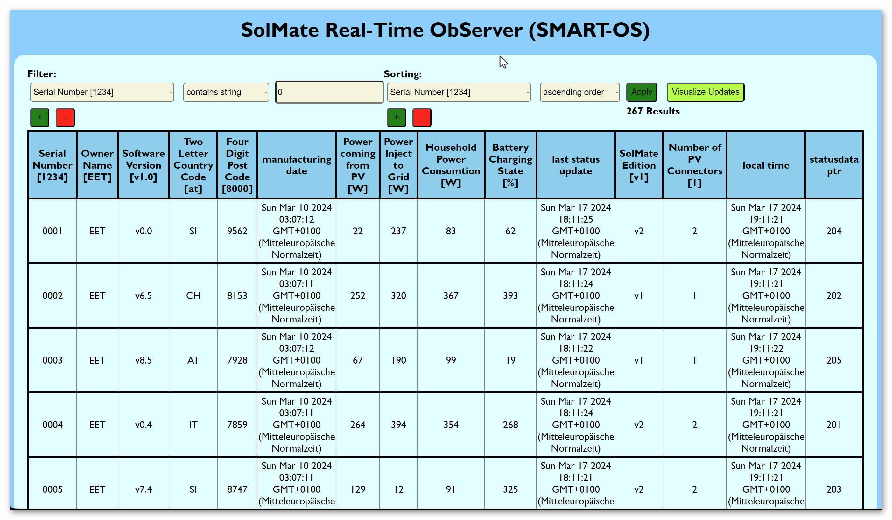

# Welcome to SMART-OS Doc
The SolMate Real-Time ObServer Documentation

interactive interface with filter and sorting options. The data gets updated in Real-Time.

# Distinctiveness and Complexity
This project uses Asynchronous programming throughout at the back- and frontend. Concurrent programming is used to simulate multiple remote devices at the same machine.

In contrast to all projects throughout this course, this application does not require continuing client http requests to the server to keep all data updated in Real-Time. Hence this project adds a new level of complexity, performance and enriches the gained skillset within this course.  

Furthermore this project contains thorough testing capabilities which are in stark contrast to most of the project requirements.

The main focus of this project lies in the Real-Time and performant behaviour in data transmission, as well as data simulation. The data customisation is achieved via filter and sorting options.

This project has a real world application, when running the according lightweight python file on any remote device connected with the server. This is because this lightweight python file can easily be customized to represent data of personal interest, related to the machine which it runs on.

## No Social Network
To distuingish from a social network, this project has no ability to post or chat, alltough Django Channels is able to run a chat application very efficiently with Real-Time communication.

## No E-Commerce Site
To distinguish from a Commerce site this project does not contain any selling or buying functionality. 

## Utilizes Django
This App utilizes the Django Framework and makes use of Django Channels, the asynchronous websocket implementation in Django. 

## App is Mobile Responsive
This app has been successfully tested in a local network utilizing Raspberry Pi 4B as remote device (running the lightweight python file), while running the Django Channels Webserver on a computer within this network and accessing it with multiple client devices (Cellphone and laptop) at the same time. The application has been successfully tested with up to 267 simulated remote device instances, updating in Real-Time to the Server, distributed in Real-Time to all clients accessing the server via a browser.

# About SMART-OS
Updated as of 17.03.2024 

## Features
SMART-OS is an App to monitor Data from remote devices and display it in Real-Time publicly to a webserver. This may have an application in tracking device conditions after shipping like battery capacity, software version, power consumption, power generation of photovoltaik panels and keeping the exact geolocation for weather considerations.

### Webserver
The core is made up by a Django Channels server (utilizing asynchronous Daphne server, and a cache maintainance with Redis), enabling the Real-Time data distribution to all clients to this webserver, achieved via a simple GET request to the webservers root route. There is no restriction in accessing the data updates of all updating remote devices.

### Remote Devices
Updates are coming from all devices with active connection to the webserver network, running a single python file ("solmate.py"), stored on the trackable device. After startup it builds up and maintaines a websocket connection to the webserver, sending data only on change (observer pattern) to avoid data overload. By default data history is not stored, all data reflect only the latest updates without access to trends. The latest data received by the server is parallel stored to the database and distributed to all webserver clients. So the database, as well as all connected clients, are updated in Real-Time with the current device parameters. On connection loss the device attempts to reconnect in a defined time interval (default is five seconds). New devices can be automatically registered at the database upon first connection to the webserver. This has to be activated in the according file. 

### Logging
There is a thorough process logging upon startup for the webserver at "solserver/database/log/general.log", storing the latest 1 MB of logging entries. Besides testing procedures all messages towards the server are stored to this file. A data history can therefore be retrieved until this log file is overridden.

## Startup
Detailed information how to start up and test the webserver can be found at the section Start Up.

## TODOs
As any software also this has some potential for improvement and customisation:

* Authentication (device data restriction to owner).

* Pagination (limit results to 10-20 devices each page).

* Break Table (On smaller screen the table should be scrollable while handy to keep an overview).

* Dynamic table entries (Django models should adapt to the monitoring parameters defined by the remote devices - maybe via json file in database).

* Store data history and depict data trends for Machine Learning.

* Show 30 sec trend in GUI upon device click 

* change operating system to Linux for dockerisation and automated documentation. 

* Implement a CI/CD pipeline upon git commit (Each software change ought to be controlled via github actions testing and automated software update distribution to all devices).

* implement remote control for maintainance and software updates (setting parameter and/or runninng downloaded scripts).

* implement capability for IoT (each device should obtain all the data of all the other devices via implementing another channel to achieve this)

